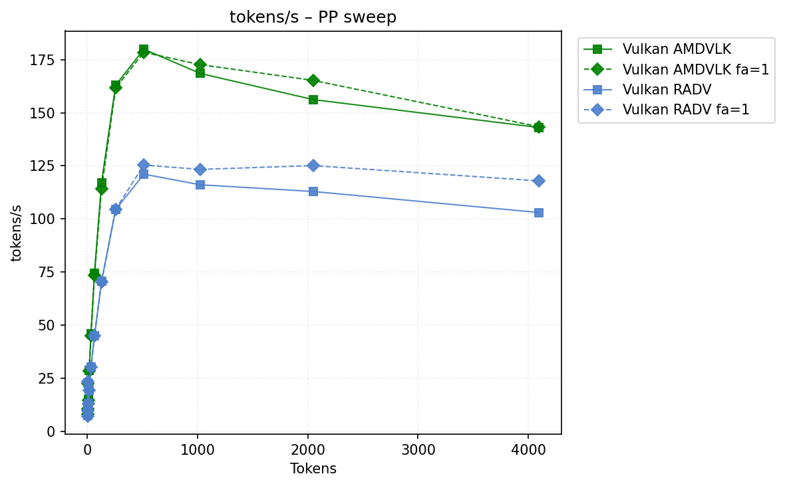
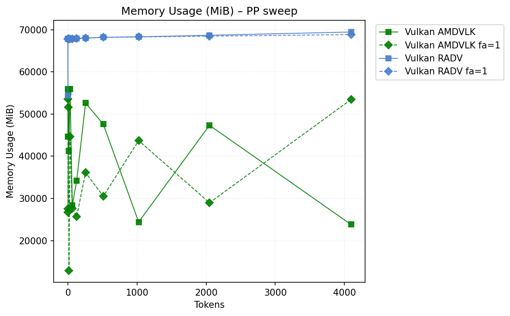

# Benchmark Results
| backend                 | hipblaslt   | -fa   | -b   | pp512          | tg128         | max_mem   |
|-------------------------|-------------|-------|------|----------------|---------------|-----------|
| llama.cpp-vulkan_amdvlk |             |       |      | **179.907472** | 22.659149     | 67872     |
| llama.cpp-vulkan_amdvlk |             | -fa 1 |      | 178.493509     | 22.568994     | **56919** |
| llama.cpp-vulkan_radv   |             |       |      | 121.111891     | 22.816947     | 69457     |
| llama.cpp-vulkan_radv   |             | -fa 1 |      | 125.373039     | **23.354522** | 68851     |
## Performance Charts

### Tokens/s Performance

### Memory Usage

## Detailed Sweeps

### PP sweep
| backend                 | hipblaslt   | -fa   | -b   | 1             | 2          | 4             | 8             | 16            | 32            | 64            | 128            | 256            | 512            | 1024           | 2048          | 4096           |
|-------------------------|-------------|-------|------|---------------|------------|---------------|---------------|---------------|---------------|---------------|----------------|----------------|----------------|----------------|---------------|----------------|
| llama.cpp-vulkan_amdvlk |             |       |      | 22.872535     | **8.4834** | **10.869838** | **14.893267** | **28.818575** | **45.911498** | **74.549359** | **117.121647** | **162.966671** | **179.907472** | 168.51754      | 156.212927    | 143.083618     |
| llama.cpp-vulkan_amdvlk |             | -fa 1 |      | 22.625905     | 8.228171   | 10.668079     | 14.733391     | 28.450417     | 45.157245     | 73.43933      | 114.300512     | 161.663906     | 178.493509     | **172.640201** | **165.25734** | **143.460176** |
| llama.cpp-vulkan_radv   |             |       |      | 22.795383     | 7.401614   | 9.581238      | 13.007452     | 19.515867     | 30.254692     | 45.09763      | 70.656826      | 104.417038     | 121.111891     | 116.105057     | 112.946838    | 103.041596     |
| llama.cpp-vulkan_radv   |             | -fa 1 |      | **23.389938** | 7.31098    | 9.508247      | 12.974523     | 19.480042     | 30.170149     | 45.02835      | 70.292402      | 104.627859     | 125.373039     | 123.355254     | 125.130777    | 117.939397     |
### TG sweep
| backend                 | hipblaslt   | -fa   | -b   | 1             | 2             | 4             | 8             | 16            | 32           | 64            | 128           | 256           | 512           | 1024          | 2048          | 4096          |
|-------------------------|-------------|-------|------|---------------|---------------|---------------|---------------|---------------|--------------|---------------|---------------|---------------|---------------|---------------|---------------|---------------|
| llama.cpp-vulkan_amdvlk |             |       |      | 22.889946     | 22.817896     | 22.855077     | 22.854883     | 22.900801     | 22.86579     | 22.790031     | 22.659149     | 22.389196     | 21.839833     | 20.755526     | 17.398342     | 13.502947     |
| llama.cpp-vulkan_amdvlk |             | -fa 1 |      | 22.612863     | 22.39481      | 22.562107     | 22.527469     | 22.54389      | 22.555777    | 22.558909     | 22.568994     | 22.562908     | 22.31468      | 21.745054     | 20.463672     | 18.235045     |
| llama.cpp-vulkan_radv   |             |       |      | 23.128591     | 22.993931     | 23.104712     | 23.119541     | 23.041662     | 23.097979    | 22.887747     | 22.816947     | 22.572828     | 22.083661     | 20.869181     | 17.582163     | 13.625307     |
| llama.cpp-vulkan_radv   |             | -fa 1 |      | **23.179446** | **23.312424** | **23.378321** | **23.382872** | **23.350885** | **23.38358** | **23.371056** | **23.354522** | **23.332192** | **23.181289** | **22.899991** | **22.200015** | **20.742319** |