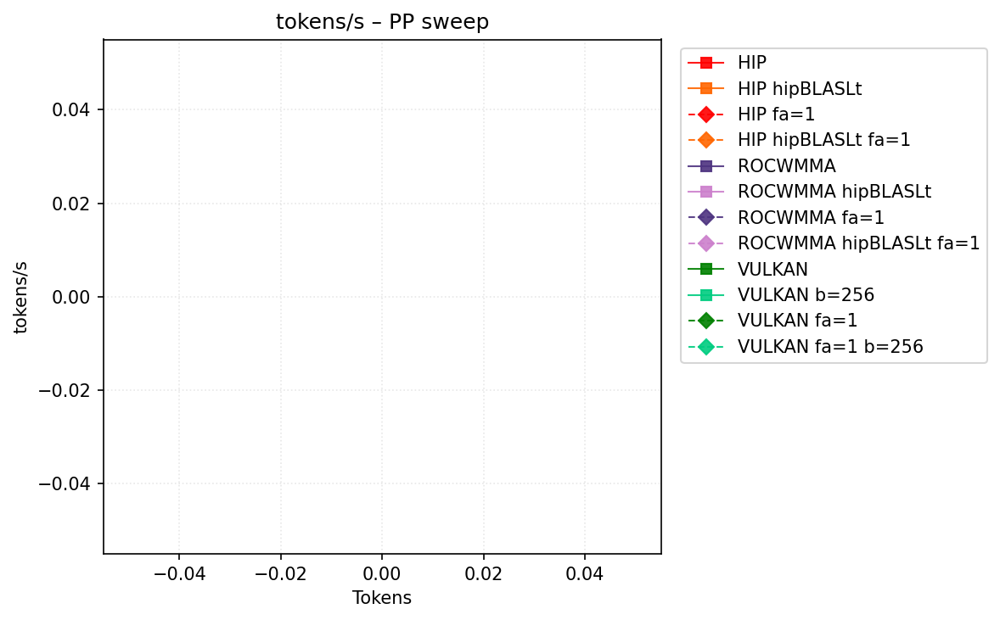
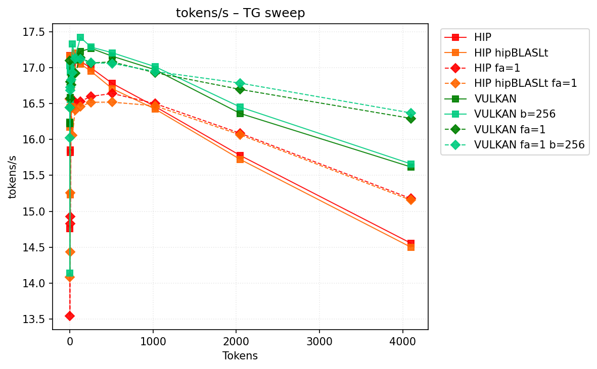
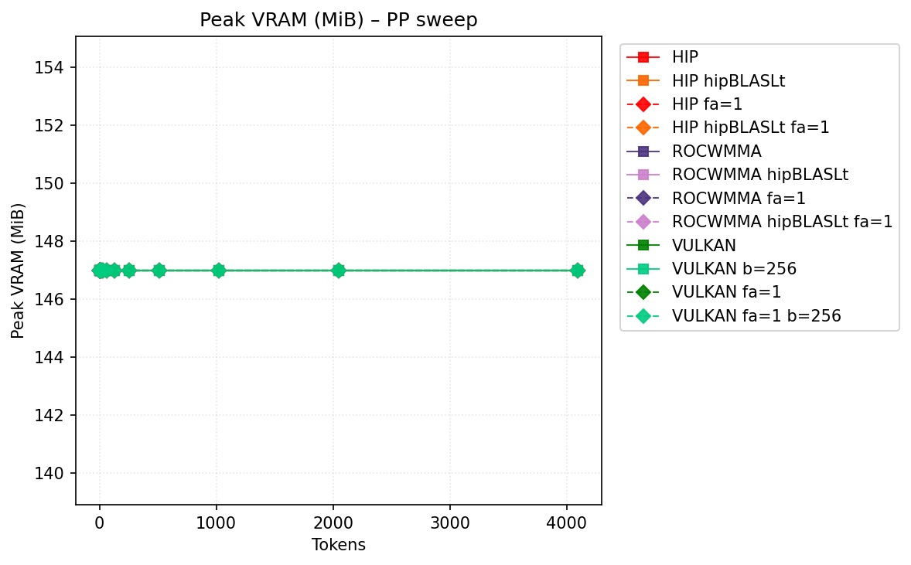
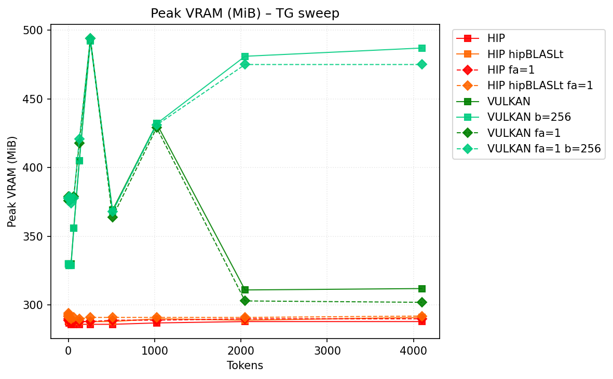

# Benchmark Results
| backend           | hipblaslt   | -fa   | -b     |   pp512 | tg128        | max_mem   |
|-------------------|-------------|-------|--------|---------|--------------|-----------|
| llama.cpp-hip     |             |       |        | nan     | 17.502978    | 68447     |
| llama.cpp-hip     | 1           |       |        | 216.984 | 17.583902    | 69062     |
| llama.cpp-hip     |             | -fa 1 |        | nan     | 17.521247    | 68520     |
| llama.cpp-hip     | 1           | -fa 1 |        | nan     | 17.546185    | **68413** |
| llama.cpp-rocwmma |             |       |        | 125.482 | 17.531297    | 68893     |
| llama.cpp-rocwmma | 1           |       |        | nan     | 17.535269    | 68940     |
| llama.cpp-rocwmma |             | -fa 1 |        | 126.601 | 17.363605    | 68462     |
| llama.cpp-rocwmma | 1           | -fa 1 |        | 223.382 | 17.401254    | 68498     |
| llama.cpp-vulkan  |             |       |        | 297.513 | 18.279067    | 69118     |
| llama.cpp-vulkan  |             |       | -b 256 | 246.303 | **18.33226** | 68940     |
| llama.cpp-vulkan  |             | -fa 1 |        | 296.559 | 18.090053    | 69072     |
| llama.cpp-vulkan  |             | -fa 1 | -b 256 | 244.783 | 18.082842    | 68895     |
## Performance Charts

### Tokens/s Performance

### Memory Usage

## Detailed Sweeps

### PP sweep
| backend           | hipblaslt   | -fa   | -b     | 1             | 2             | 4             | 8             | 16            | 32            | 64             | 128            | 256            |     512 |    1024 |    2048 |    4096 |
|-------------------|-------------|-------|--------|---------------|---------------|---------------|---------------|---------------|---------------|----------------|----------------|----------------|---------|---------|---------|---------|
| llama.cpp-hip     |             |       |        | 17.613157     | **20.021546** | 16.807072     | 9.289656      | 13.32548      | 22.381542     | 101.232074     | 139.673457     | 152.585962     | nan     | nan     | nan     | nan     |
| llama.cpp-hip     | 1           |       |        | 14.115808     | 19.122242     | 16.850557     | 8.969521      | 12.782702     | 21.858072     | 103.449355     | 148.781757     | 178.168505     | 216.984 | nan     | nan     | 197.292 |
| llama.cpp-hip     |             | -fa 1 |        | 15.908462     | 18.500705     | 17.19038      | 8.78939       | 13.497554     | 22.446856     | 95.999991      | 131.354476     | nan            | nan     | nan     | nan     | nan     |
| llama.cpp-hip     | 1           | -fa 1 |        | 17.199783     | nan           | 16.993748     | 8.919779      | 13.325765     | 22.288259     | **104.192284** | nan            | 171.876458     | nan     | nan     | nan     | nan     |
| llama.cpp-rocwmma |             |       |        | 17.223789     | 18.86117      | 17.346518     | 9.174349      | 13.391416     | 22.429674     | 95.924032      | 142.338862     | 155.025653     | 125.482 | nan     | nan     | nan     |
| llama.cpp-rocwmma | 1           |       |        | 17.502636     | 19.954508     | 16.476196     | 8.659589      | 13.012302     | 21.577813     | 98.529755      | 146.227772     | 177.659228     | nan     | 213.711 | 206.936 | nan     |
| llama.cpp-rocwmma |             | -fa 1 |        | 17.326234     | 19.264052     | **17.416714** | 8.841062      | 13.115019     | 22.45665      | 100.578923     | 141.21424      | 153.978274     | 126.601 | 126.891 | 126.008 | nan     |
| llama.cpp-rocwmma | 1           | -fa 1 |        | 17.406182     | 19.579671     | 16.738008     | 8.847246      | 13.145979     | 22.68518      | 97.980407      | **153.123679** | 184.585602     | 223.382 | nan     | 224.367 | nan     |
| llama.cpp-vulkan  |             |       |        | 18.309298     | 7.553142      | 9.383447      | 12.134513     | 27.076195     | 45.782142     | 77.128029      | 145.549917     | **251.174777** | 297.513 | 280.983 | 271.265 | 265.487 |
| llama.cpp-vulkan  |             |       | -b 256 | **18.361854** | 7.557951      | 9.376908      | **12.137574** | **27.328392** | 45.626821     | 77.3419        | 145.638585     | 251.082478     | 246.303 | 239.553 | 229.981 | 223.001 |
| llama.cpp-vulkan  |             | -fa 1 |        | 18.109738     | 7.484097      | 9.345794      | 12.124001     | 27.013097     | **46.046144** | 77.18043       | 145.592062     | 250.356375     | 296.559 | 288.853 | 277.765 | 262.337 |
| llama.cpp-vulkan  |             | -fa 1 | -b 256 | 18.076176     | 7.496015      | 9.33933       | 12.130019     | 26.979742     | 45.944804     | 77.373488      | 145.442259     | 249.045886     | 244.783 | 236.862 | 227.951 | 218.51  |
### TG sweep
| backend           | hipblaslt   | -fa   | -b     | 1             | 2             | 4             | 8             | 16            | 32            | 64            | 128          | 256           | 512           | 1024          | 2048          | 4096          |
|-------------------|-------------|-------|--------|---------------|---------------|---------------|---------------|---------------|---------------|---------------|--------------|---------------|---------------|---------------|---------------|---------------|
| llama.cpp-hip     |             |       |        | 17.623542     | 16.470957     | 16.284893     | 17.514347     | 17.497765     | 17.617739     | 17.610996     | 17.502978    | 17.480928     | 17.258174     | 16.91499      | 16.156006     | 14.893979     |
| llama.cpp-hip     | 1           |       |        | 13.993411     | 17.617352     | 17.648123     | 17.485302     | 17.449176     | 17.59583      | 17.614285     | 17.583902    | 17.479028     | 17.266778     | 16.910955     | 16.137714     | 14.95697      |
| llama.cpp-hip     |             | -fa 1 |        | 17.508076     | 17.538034     | 16.608754     | 16.964596     | 17.377397     | 17.517985     | 17.435299     | 17.521247    | 17.516363     | 17.525458     | 17.444317     | 17.282213     | 16.961011     |
| llama.cpp-hip     | 1           | -fa 1 |        | 17.516083     | 17.516554     | 17.036175     | 17.370329     | 17.535709     | 17.434828     | 17.455885     | 17.546185    | 17.565386     | 17.543081     | 17.443601     | 17.238474     | 16.895334     |
| llama.cpp-rocwmma |             |       |        | 17.608291     | 17.603921     | 17.518948     | 17.503655     | 17.601194     | 17.617504     | 17.59885      | 17.531297    | 17.421962     | 17.214729     | 16.865958     | 16.12439      | 14.890495     |
| llama.cpp-rocwmma | 1           |       |        | 17.544229     | 16.758219     | 17.599367     | 17.310126     | 17.394154     | 17.504389     | 17.560415     | 17.535269    | 17.431177     | 17.185598     | 16.838397     | 16.121811     | 14.877643     |
| llama.cpp-rocwmma |             | -fa 1 |        | 17.365921     | 17.263029     | 17.146231     | 17.12232      | 17.248564     | 17.292205     | 17.333711     | 17.363605    | 17.383859     | 17.290094     | 17.227952     | 16.91446      | 16.320462     |
| llama.cpp-rocwmma | 1           | -fa 1 |        | 17.34351      | 16.815356     | 16.401832     | 17.130589     | 17.294251     | 17.314662     | 17.333639     | 17.401254    | 17.385678     | 17.279519     | 17.22869      | 16.906589     | 16.389041     |
| llama.cpp-vulkan  |             |       |        | **18.346646** | 18.346064     | **18.350486** | 18.320694     | 18.357766     | 18.349399     | 18.339627     | 18.279067    | 18.263076     | 18.183831     | 17.95251      | 17.359878     | 16.560885     |
| llama.cpp-vulkan  |             |       | -b 256 | 18.273693     | **18.364624** | 18.31124      | **18.328199** | **18.378484** | **18.358601** | **18.349982** | **18.33226** | **18.281116** | **18.207103** | **17.967609** | 17.37867      | 16.577174     |
| llama.cpp-vulkan  |             | -fa 1 |        | 18.11271      | 18.025182     | 18.04696      | 18.065966     | 18.05267      | 18.080808     | 18.072169     | 18.090053    | 18.08076      | 18.055742     | 17.934805     | 17.744609     | 17.35883      |
| llama.cpp-vulkan  |             | -fa 1 | -b 256 | 18.069072     | 18.058407     | 18.086486     | 18.058459     | 18.05906      | 18.077846     | 18.081608     | 18.082842    | 18.078751     | 18.071466     | 17.947376     | **17.749295** | **17.366281** |