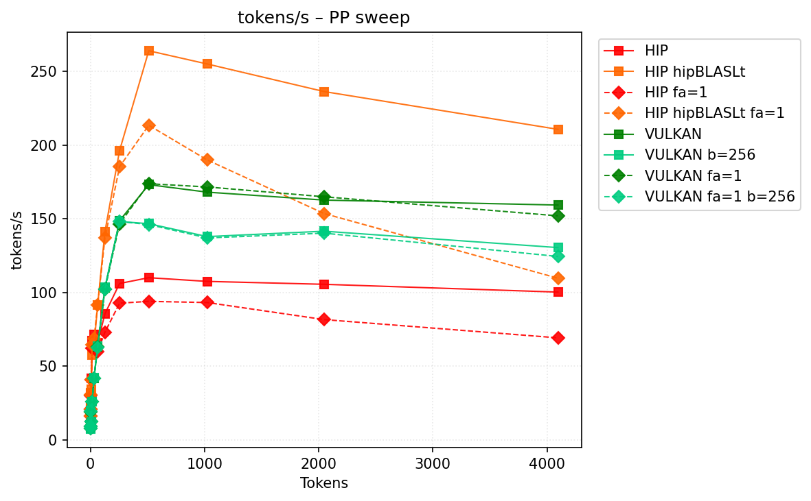
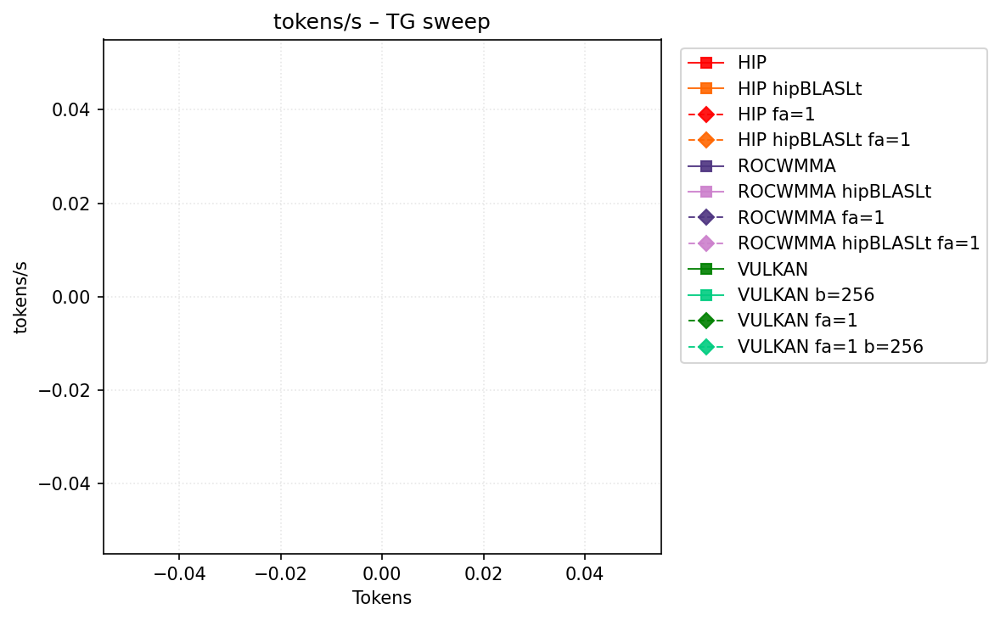
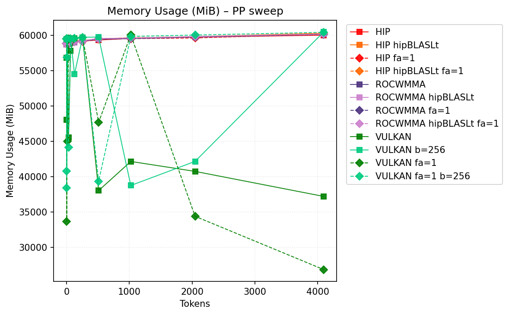
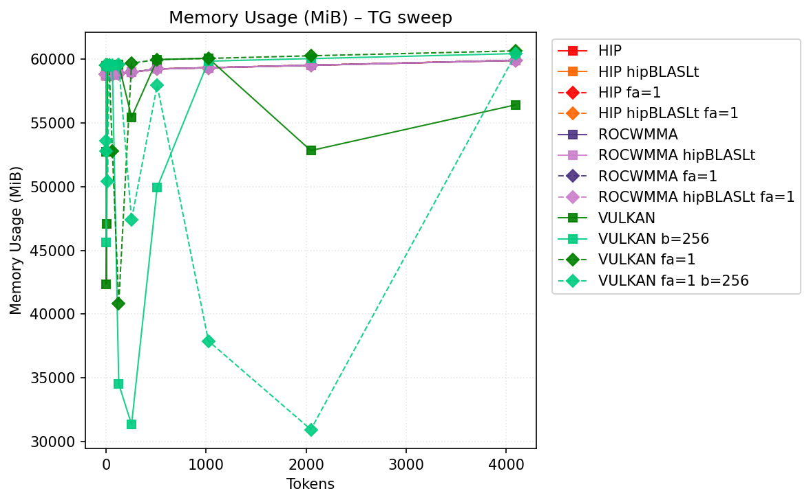

# Benchmark Results
| backend           | hipblaslt   | -fa   | -b     |   pp512 | tg128         | max_mem   |
|-------------------|-------------|-------|--------|---------|---------------|-----------|
| llama.cpp-hip     |             |       |        | nan     | 17.596959     | 60728     |
| llama.cpp-hip     | 1           |       |        | 277.37  | 17.619265     | 60765     |
| llama.cpp-hip     |             | -fa 1 |        | nan     | 17.630618     | 60209     |
| llama.cpp-hip     | 1           | -fa 1 |        | nan     | 17.647671     | 60272     |
| llama.cpp-rocwmma |             |       |        | nan     | 17.579456     | 60154     |
| llama.cpp-rocwmma | 1           |       |        | 280.865 | 17.608969     | 60161     |
| llama.cpp-rocwmma |             | -fa 1 |        | 133.586 | 17.430154     | **60132** |
| llama.cpp-rocwmma | 1           | -fa 1 |        | 306.426 | 17.454165     | 60185     |
| llama.cpp-vulkan  |             |       |        | 207.517 | **19.784728** | 60286     |
| llama.cpp-vulkan  |             |       | -b 256 | 158.498 | 19.773291     | 60481     |
| llama.cpp-vulkan  |             | -fa 1 |        | 208.779 | 19.460295     | 60658     |
| llama.cpp-vulkan  |             | -fa 1 | -b 256 | 157.763 | 19.449151     | 60429     |
## Performance Charts

### Tokens/s Performance

### Memory Usage

## Detailed Sweeps

### PP sweep
| backend           | hipblaslt   | -fa   | -b     | 1             | 2             |        4 |        8 | 16            | 32            | 64            |     128 |     256 |     512 |    1024 |    2048 |    4096 |
|-------------------|-------------|-------|--------|---------------|---------------|----------|----------|---------------|---------------|---------------|---------|---------|---------|---------|---------|---------|
| llama.cpp-hip     |             |       |        | 17.532289     | 23.209278     | nan      | nan      | 69.812352     | 72.451169     | 86.23684      | nan     | nan     | nan     | nan     | nan     | nan     |
| llama.cpp-hip     | 1           |       |        | 17.726691     | nan           | nan      |  35.4004 | 57.132778     | 65.618777     | 94.161695     | 149.217 | 207.642 | 277.37  | 266.85  | 248.435 | nan     |
| llama.cpp-hip     |             | -fa 1 |        | 17.63625      | 22.985796     |  32.2605 |  43.1693 | 65.40794      | 69.368743     | 79.903729     | nan     | nan     | nan     | nan     | nan     | nan     |
| llama.cpp-hip     | 1           | -fa 1 |        | 17.641658     | nan           | nan      |  42.8824 | nan           | 70.323119     | nan           | nan     | nan     | nan     | nan     | nan     | nan     |
| llama.cpp-rocwmma |             |       |        | 17.60451      | 23.077208     |  32.7441 |  44.7902 | **70.418243** | 72.937811     | 86.556775     | nan     | nan     | nan     | nan     | nan     | nan     |
| llama.cpp-rocwmma | 1           |       |        | 17.72246      | **23.227004** |  33.2081 |  36.7317 | 59.659939     | 66.168214     | 93.810648     | 150.812 | 211.142 | 280.865 | nan     | 252.403 | nan     |
| llama.cpp-rocwmma |             | -fa 1 |        | 17.427748     | 22.893091     |  29.7064 |  45.6647 | 69.911149     | 72.447535     | 86.978659     | 117.783 | nan     | 133.586 | nan     | nan     | nan     |
| llama.cpp-rocwmma | 1           | -fa 1 |        | 17.445637     | 22.844116     |  32.9916 |  45.5296 | 70.254364     | **74.818138** | **103.13126** | 159.389 | 223.241 | 306.426 | 304.719 | 301.876 | nan     |
| llama.cpp-vulkan  |             |       |        | **20.177059** | 8.202094      |  10.1887 |  13.607  | 28.314174     | 45.231789     | 66.851977     | 109.968 | 160.856 | 207.517 | 199.577 | 192.899 | 187.438 |
| llama.cpp-vulkan  |             |       | -b 256 | 20.162155     | 8.193323      |  10.1939 |  13.6088 | 28.234165     | 45.112944     | 66.567715     | 110.115 | 160.663 | 158.498 | 157.24  | 152.154 | 147.978 |
| llama.cpp-vulkan  |             | -fa 1 |        | 19.708104     | 8.104147      |  10.1332 |  13.5512 | 28.073818     | 44.819821     | 66.368361     | 108.97  | 159.284 | 208.779 | 204.473 | 196.364 | 182.199 |
| llama.cpp-vulkan  |             | -fa 1 | -b 256 | 19.674598     | 8.111212      |  10.1488 |  13.5628 | 28.164282     | 45.015023     | 66.583698     | 109.403 | 159.631 | 157.763 | 156.817 | 151.288 | 143.1   |
### TG sweep
| backend           | hipblaslt   | -fa   | -b     | 1             | 2             | 4             | 8             | 16            | 32            | 64            | 128           | 256           | 512           | 1024          | 2048          | 4096          |
|-------------------|-------------|-------|--------|---------------|---------------|---------------|---------------|---------------|---------------|---------------|---------------|---------------|---------------|---------------|---------------|---------------|
| llama.cpp-hip     |             |       |        | 17.76483      | 17.765299     | 17.782477     | 17.7718       | 17.764322     | 17.71037      | 17.690156     | 17.596959     | 17.465746     | 17.086773     | 16.508683     | 15.273543     | 13.464539     |
| llama.cpp-hip     | 1           |       |        | 17.748187     | 17.758003     | 17.759363     | 17.761185     | 17.788738     | 17.780936     | 17.699438     | 17.619265     | 17.451368     | 17.112536     | 16.55305      | 15.28479      | 13.466692     |
| llama.cpp-hip     |             | -fa 1 |        | 17.624578     | 17.656468     | 17.651901     | 17.66424      | 17.648341     | 17.585051     | 17.643582     | 17.630618     | 17.602966     | 17.613641     | 17.453646     | 17.166482     | 16.641349     |
| llama.cpp-hip     | 1           | -fa 1 |        | 17.618261     | 17.662281     | 17.66287      | 17.669317     | 17.666096     | 17.662609     | 17.655249     | 17.647671     | 17.663668     | 17.64561      | 17.461561     | 17.195103     | 16.643876     |
| llama.cpp-rocwmma |             |       |        | 17.658558     | 17.6887       | 17.696418     | 17.693171     | 17.70951      | 17.716294     | 17.67751      | 17.579456     | 17.395683     | 17.057108     | 16.474705     | 15.204061     | 13.444174     |
| llama.cpp-rocwmma | 1           |       |        | 17.687017     | 17.657114     | 17.690507     | 17.695877     | 17.706054     | 17.701346     | 17.664661     | 17.608969     | 17.390705     | 17.050597     | 16.458897     | 15.229456     | 13.426529     |
| llama.cpp-rocwmma |             | -fa 1 |        | 17.427053     | 17.472039     | 17.453227     | 17.447619     | 17.433209     | 17.439929     | 17.468172     | 17.430154     | 17.432184     | 17.262911     | 17.17406      | 16.87464      | 16.296469     |
| llama.cpp-rocwmma | 1           | -fa 1 |        | 17.435054     | 17.445673     | 17.45079      | 17.43973      | 17.422437     | 17.456847     | 17.469382     | 17.454165     | 17.424931     | 17.277107     | 17.179703     | 16.843893     | 16.267853     |
| llama.cpp-vulkan  |             |       |        | **20.121051** | 20.10382      | **20.181196** | **20.199622** | **20.205185** | 20.189313     | **20.004979** | **19.784728** | 19.627799     | 19.433657     | 19.047984     | 18.141041     | 16.962247     |
| llama.cpp-vulkan  |             |       | -b 256 | 19.983773     | **20.129644** | 20.146643     | 20.192293     | 20.170112     | **20.204617** | 20.003954     | 19.773291     | **19.639026** | **19.447994** | 19.038758     | 18.19559      | 16.950563     |
| llama.cpp-vulkan  |             | -fa 1 |        | 19.661891     | 19.683702     | 19.712969     | 19.722351     | 19.732208     | 19.726233     | 19.649365     | 19.460295     | 19.367802     | 19.286399     | **19.061774** | 18.662457     | **18.170278** |
| llama.cpp-vulkan  |             | -fa 1 | -b 256 | 19.541611     | 19.717451     | 19.633136     | 19.735374     | 19.735589     | 19.721665     | 19.62959      | 19.449151     | 19.370583     | 19.274488     | 19.033888     | **18.696495** | 18.142023     |