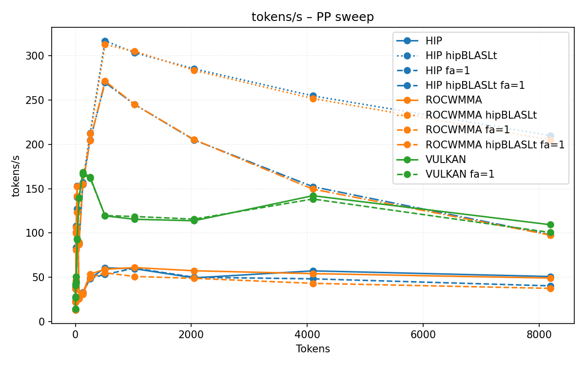
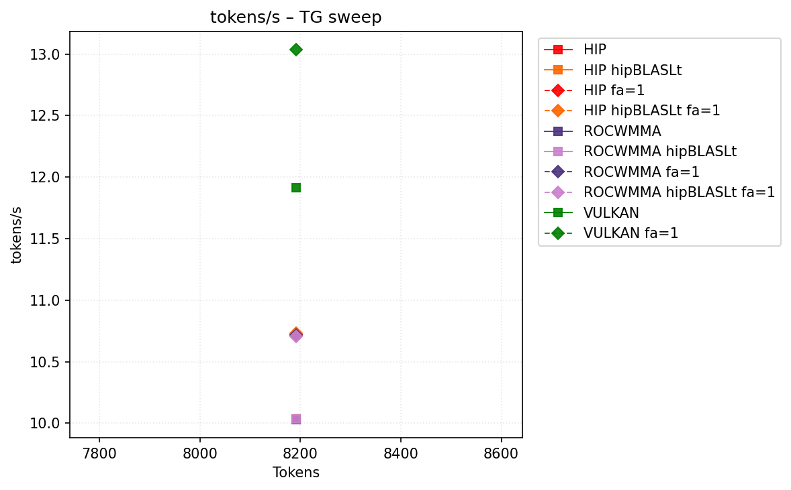
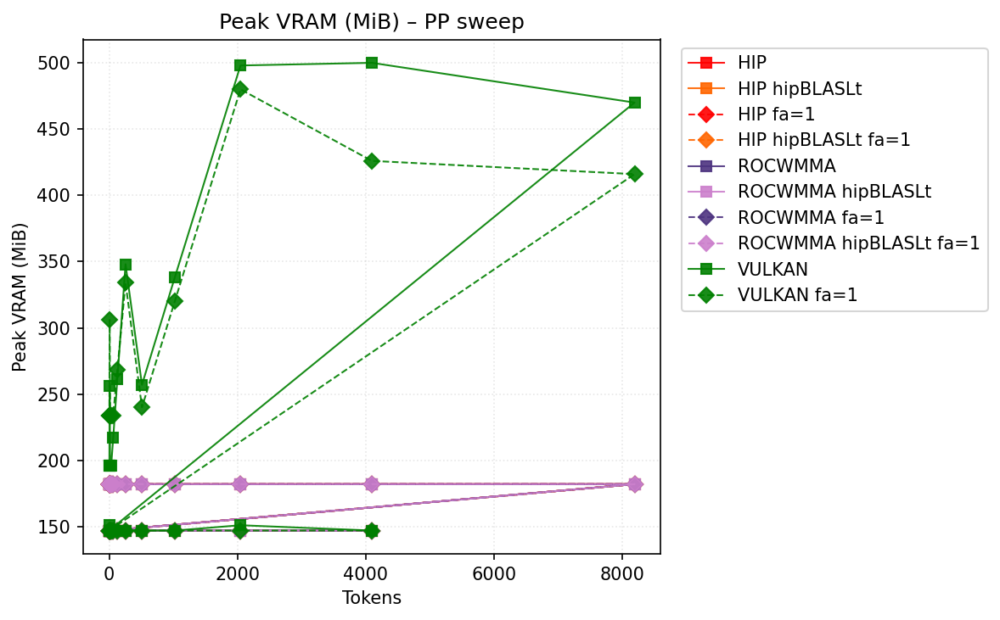
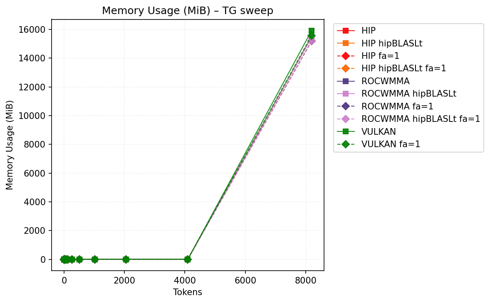

# Benchmark Results
| backend           | hipblaslt   | -fa   | -b   | pp512          | tg128              | max_mem   |
|-------------------|-------------|-------|------|----------------|--------------------|-----------|
| llama.cpp-hip     |             |       |      | 95.837263      | 13.921584          | 15889     |
| llama.cpp-hip     | 1           |       |      | 335.549009     | 13.924312          | 15921     |
| llama.cpp-hip     |             | -fa 1 |      | 89.855567      | 13.893936          | 15647     |
| llama.cpp-hip     | 1           | -fa 1 |      | 289.883182     | 13.932815          | 15679     |
| llama.cpp-rocwmma |             |       |      | 95.123124      | 13.911503          | 15889     |
| llama.cpp-rocwmma | 1           |       |      | 340.066741     | 13.900516          | 15921     |
| llama.cpp-rocwmma |             | -fa 1 |      | 95.179552      | 13.809396          | 15647     |
| llama.cpp-rocwmma | 1           | -fa 1 |      | **368.538271** | 13.833245999999999 | 15679     |
| llama.cpp-vulkan  |             |       |      | 203.942578     | **14.564472**      | 15936     |
| llama.cpp-vulkan  |             | -fa 1 |      | 203.261058     | 14.370849          | **15582** |
## Performance Charts

### Tokens/s Performance

### Memory Usage

## Detailed Sweeps

### PP sweep
| backend           | hipblaslt   | -fa   | -b   | 1                  | 2             | 4            | 8             | 16                | 32             | 64             | 128            | 256            | 512            | 1024           | 2048          | 4096           | 8192           |
|-------------------|-------------|-------|------|--------------------|---------------|--------------|---------------|-------------------|----------------|----------------|----------------|----------------|----------------|----------------|---------------|----------------|----------------|
| llama.cpp-hip     |             |       |      | 13.971948          | 24.154183     | 40.820201    | 49.373677     | 114.172434        | **160.038394** | 62.145742      | 89.339257      | 94.59756       | 95.837263      | 95.003397      | 93.816192     | 91.09746       | 50.821442      |
| llama.cpp-hip     | 1           |       |      | 13.998242          | 23.974635     | 39.635238    | 39.045546     | 87.61299700000001 | 130.346909     | 94.066373      | 168.728916     | 222.953593     | 335.549009     | 324.181405     | 306.347039    | 280.384683     | **209.958664** |
| llama.cpp-hip     |             | -fa 1 |      | 13.849496          | 23.654781     | 39.183305    | 48.362137     | 107.229327        | 146.279358     | 60.922334      | 85.322785      | 91.895594      | 89.855567      | 87.987642      | 82.315224     | 71.840704      | 40.299797      |
| llama.cpp-hip     | 1           | -fa 1 |      | 13.91733           | 23.796739     | 38.830171    | 48.37744      | 107.574768        | 145.906389     | 95.712189      | 166.898748     | 212.013308     | 289.883182     | 260.370637     | 215.674759    | 158.441418     | 97.969096      |
| llama.cpp-rocwmma |             |       |      | 13.940692          | 23.93293      | 40.376449    | **49.892713** | 113.174124        | 158.202289     | 62.493701      | 86.855019      | 94.936989      | 95.123124      | 94.868832      | 93.560032     | 91.547521      | 49.112958      |
| llama.cpp-rocwmma | 1           |       |      | 13.964974999999999 | 23.923738     | 39.67479     | 41.81579      | 95.526935         | 137.456535     | 96.251726      | 171.614558     | 227.288579     | 340.066741     | 325.942294     | 307.353854    | 283.205981     | 205.103784     |
| llama.cpp-rocwmma |             | -fa 1 |      | 13.838844          | 23.637884     | 39.353916    | 49.785584     | 113.700173        | 158.704356     | 61.768454      | 85.523409      | 95.930116      | 95.179552      | 96.448575      | 96.37396      | nan            | 37.462679      |
| llama.cpp-rocwmma | 1           | -fa 1 |      | 13.788036          | 23.713419     | 39.827511    | 49.285856     | **115.122215**    | 158.686158     | 100.634452     | 178.733315     | **234.651643** | **368.538271** | **364.290691** | **361.47111** | **347.769433** | 97.617684      |
| llama.cpp-vulkan  |             |       |      | **14.648945**      | **28.160204** | **47.07824** | 49.798461     | 66.050724         | 120.886659     | **163.078133** | **205.172323** | 204.870105     | 203.942578     | 195.570249     | 191.286972    | 187.086076     | 109.310075     |
| llama.cpp-vulkan  |             | -fa 1 |      | 14.443813          | 27.149311     | 45.735139    | 49.163091     | 65.062973         | 119.260504     | 161.660837     | 201.526638     | 203.450403     | 203.261058     | 200.450238     | 194.905674    | 184.671255     | 100.512613     |
### TG sweep
| backend           | hipblaslt   | -fa   | -b   | 1                  | 2                      | 4             | 8                  | 16            | 32            | 64            | 128                | 256           | 512           | 1024                   | 2048               | 4096          | 8192          |
|-------------------|-------------|-------|------|--------------------|------------------------|---------------|--------------------|---------------|---------------|---------------|--------------------|---------------|---------------|------------------------|--------------------|---------------|---------------|
| llama.cpp-hip     |             |       |      | 13.941485          | 13.954657              | 13.982291     | 13.973651          | 13.967073     | 13.961821     | 13.940584     | 13.921584          | 13.837209     | 13.694206     | 13.390619              | 12.797395999999999 | 11.841425     | 10.034434     |
| llama.cpp-hip     | 1           |       |      | 13.954519          | 13.932869              | 13.969708     | 13.984647          | 13.978389     | 13.993403     | 13.966205     | 13.924312          | 13.848367     | 13.678884     | 13.40042               | 12.801941          | 11.845011     | 10.035445     |
| llama.cpp-hip     |             | -fa 1 |      | 13.931397          | 13.921896              | 13.889504     | 13.886656          | 13.890007     | 13.88122      | 13.915401     | 13.893936          | 13.893959     | 13.900578     | 13.789967              | 13.681988          | 13.417192     | 10.722624     |
| llama.cpp-hip     | 1           | -fa 1 |      | 13.920960000000001 | 13.878969              | 13.918599     | 13.910024          | 13.907882     | 13.936231     | 13.907731     | 13.932815          | 13.92143      | 13.90215      | 13.815803              | 13.692369          | 13.440949     | 10.734519     |
| llama.cpp-rocwmma |             |       |      | 13.935936          | 13.95204               | 13.963437     | 13.975286          | 13.951455     | 13.973667     | 13.954597     | 13.911503          | 13.819465     | 13.65526      | 13.361033              | 12.780033          | 11.809533     | 10.032416     |
| llama.cpp-rocwmma | 1           |       |      | 13.984124          | 13.954128              | 13.968367     | 13.957326          | 13.952851     | 13.980139     | 13.959088     | 13.900516          | 13.819613     | 13.647664     | 13.377542              | 12.769124          | 11.82216      | 10.033583     |
| llama.cpp-rocwmma |             | -fa 1 |      | 13.797312999999999 | 13.803953              | 13.801314     | 13.795895999999999 | 13.793939     | 13.798743     | 13.828075     | 13.809396          | 13.831383     | 13.724669     | 13.670047              | 13.424996          | 13.018014     | 10.714311     |
| llama.cpp-rocwmma | 1           | -fa 1 |      | 13.815948          | 13.805602              | 13.8046       | 13.820791          | 13.776209     | 13.830713     | 13.803897     | 13.833245999999999 | 13.802609     | 13.727462     | 13.668381              | 13.429685          | 13.028066     | 10.705802     |
| llama.cpp-vulkan  |             |       |      | **14.656039**      | **14.632287999999999** | **14.609669** | **14.621595**      | **14.602997** | **14.594336** | **14.568826** | **14.564472**      | **14.524809** | **14.464025** | **14.279997999999999** | 13.817553          | 13.171919     | 11.912339     |
| llama.cpp-vulkan  |             | -fa 1 |      | 14.475423          | 14.431547              | 14.421215     | 14.418501          | 14.398542     | 14.387699     | 14.384464     | 14.370849          | 14.375283     | 14.347603     | 14.257958              | **14.093933**      | **13.794455** | **13.036002** |