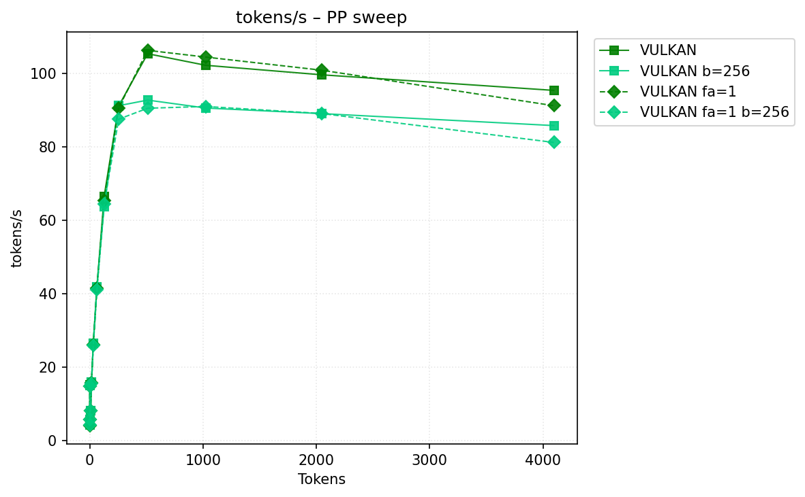
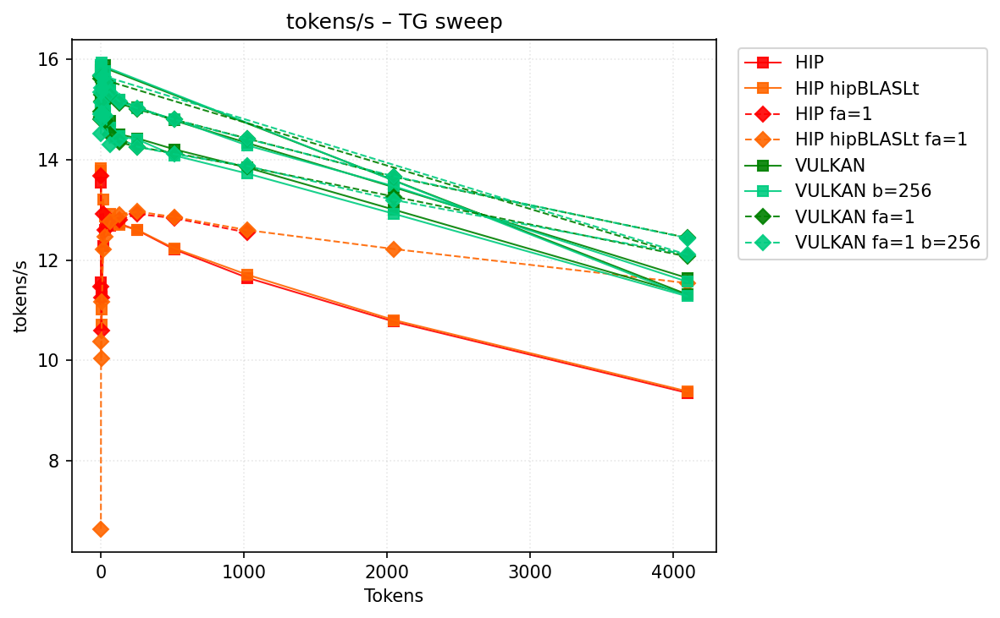
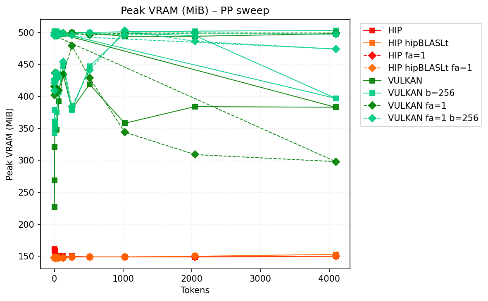
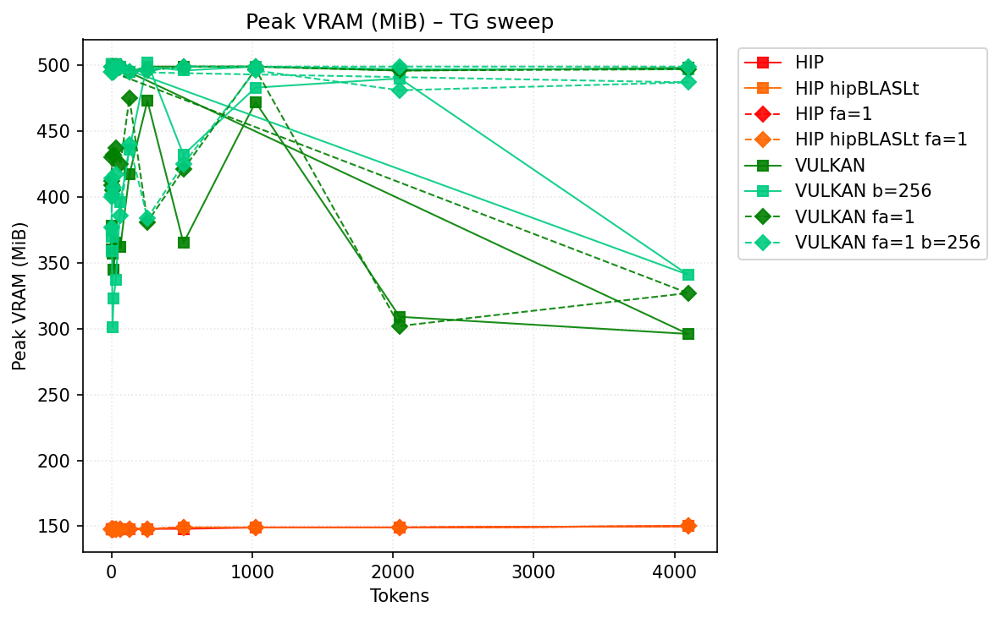

# Benchmark Results
| backend          | hipblaslt   | -fa   | -b     | pp512          | tg128         | max_mem    |
|------------------|-------------|-------|--------|----------------|---------------|------------|
| llama.cpp-vulkan |             |       |        | 105.460629     | **14.508313** | 101258     |
| llama.cpp-vulkan |             |       | -b 256 | 92.812243      | 14.465618     | 100984     |
| llama.cpp-vulkan |             | -fa 1 |        | **106.374696** | 14.349813     | 100941     |
| llama.cpp-vulkan |             | -fa 1 | -b 256 | 90.59583       | 14.423688     | **100787** |
## Performance Charts

### Tokens/s Performance

### Memory Usage

## Detailed Sweeps

### PP sweep
| backend          | hipblaslt   | -fa   | -b     | 1             | 2            | 4            | 8           | 16            | 32            | 64            | 128           | 256          | 512            | 1024           | 2048           | 4096          |
|------------------|-------------|-------|--------|---------------|--------------|--------------|-------------|---------------|---------------|---------------|---------------|--------------|----------------|----------------|----------------|---------------|
| llama.cpp-vulkan |             |       |        | **15.079672** | **4.182936** | **5.700703** | 8.160165    | 15.823324     | **26.474235** | 41.832659     | **66.598439** | 91.210959    | 105.460629     | 102.302428     | 99.707978      | **95.458195** |
| llama.cpp-vulkan |             |       | -b 256 | 15.011729     | 4.179972     | 5.694969     | **8.17611** | **15.843124** | 26.414215     | **41.851938** | 63.824734     | **91.28795** | 92.812243      | 90.649385      | 89.127242      | 85.864029     |
| llama.cpp-vulkan |             | -fa 1 |        | 14.84702      | 4.130335     | 5.667882     | 8.11506     | 15.749897     | 26.118305     | 41.555316     | 65.45985      | 90.711952    | **106.374696** | **104.543175** | **100.963683** | 91.285457     |
| llama.cpp-vulkan |             | -fa 1 | -b 256 | 14.712502     | 4.139178     | 5.658322     | 8.117477    | 15.616714     | 25.857406     | 41.144429     | 64.50678      | 87.608791    | 90.59583       | 91.071951      | 89.149936      | 81.264985     |
### TG sweep
| backend          | hipblaslt   | -fa   | -b     | 1             | 2             | 4            | 8             | 16                 | 32            | 64            | 128           | 256           | 512           | 1024          | 2048          | 4096          |
|------------------|-------------|-------|--------|---------------|---------------|--------------|---------------|--------------------|---------------|---------------|---------------|---------------|---------------|---------------|---------------|---------------|
| llama.cpp-vulkan |             |       |        | **15.160266** | **15.125128** | 15.03562     | 15.044525     | 15.093508          | 14.950227     | **14.777473** | **14.508313** | **14.426415** | **14.209365** | 13.842041     | 13.002953     | 11.313306     |
| llama.cpp-vulkan |             |       | -b 256 | 15.089715     | 15.032438     | **15.15052** | **15.183483** | **15.119451**      | **15.045627** | 14.632479     | 14.465618     | 14.404762     | 14.086222     | 13.724275     | 12.921185     | 11.276079     |
| llama.cpp-vulkan |             | -fa 1 |        | 14.951974     | 14.804874     | 14.851207    | 14.848219     | 14.849796          | 14.779346     | 14.501357     | 14.349813     | 14.255924     | 14.131393     | 13.857324     | **13.264458** | 12.068588     |
| llama.cpp-vulkan |             | -fa 1 | -b 256 | 14.514653     | 14.910041     | 14.920484    | 14.808187     | 14.911003000000001 | 14.868728     | 14.297018     | 14.423688     | 14.258356     | 14.113837     | **13.873522** | 13.197126     | **12.105838** |