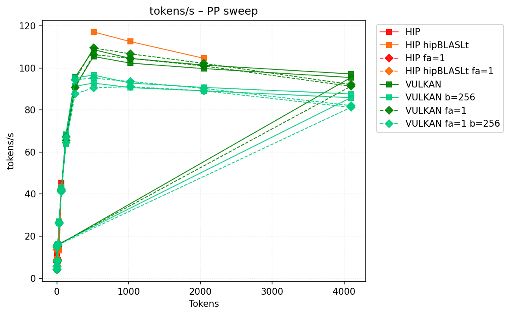
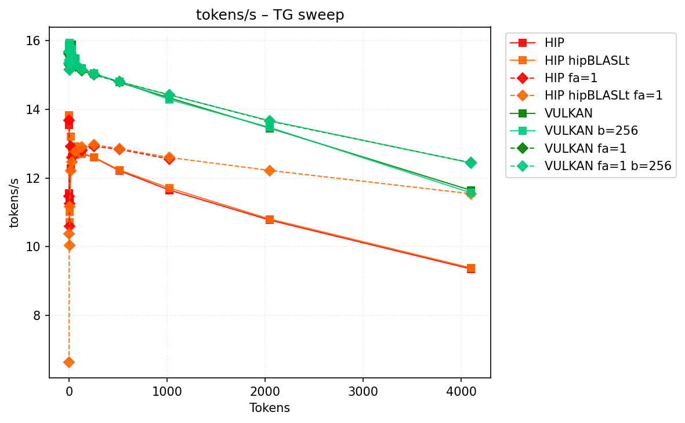
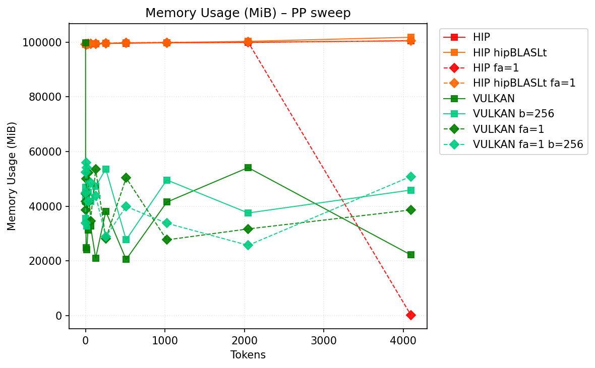
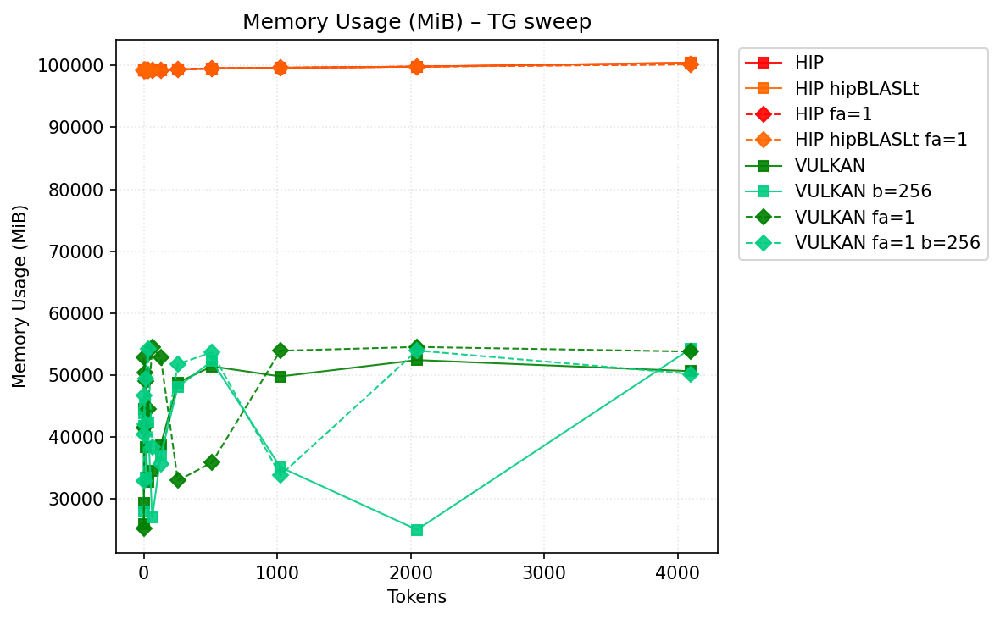

# Benchmark Results
| backend          | hipblaslt   | -fa   | -b     |    pp512 | tg128         | max_mem    |
|------------------|-------------|-------|--------|----------|---------------|------------|
| llama.cpp-hip    |             |       |        | nan      | 12.727903     | 100561     |
| llama.cpp-hip    | 1           |       |        | 117.145  | 12.703545     | 101805     |
| llama.cpp-hip    |             | -fa 1 |        | nan      | 12.798923     | **100197** |
| llama.cpp-hip    | 1           | -fa 1 |        | nan      | 12.904985     | 100448     |
| llama.cpp-vulkan |             |       |        | 105.461  | **14.508313** | 101258     |
| llama.cpp-vulkan |             |       | -b 256 |  92.8122 | 14.465618     | 100984     |
| llama.cpp-vulkan |             | -fa 1 |        | 106.375  | 14.349813     | 100941     |
| llama.cpp-vulkan |             | -fa 1 | -b 256 |  90.5958 | 14.423688     | 100787     |
## Performance Charts

### Tokens/s Performance

### Memory Usage

## Detailed Sweeps

### PP sweep
| backend          | hipblaslt   | -fa   | -b     | 1             | 2             | 4            |         8 | 16            | 32            | 64            |      128 |      256 |      512 |     1024 |     2048 |     4096 |
|------------------|-------------|-------|--------|---------------|---------------|--------------|-----------|---------------|---------------|---------------|----------|----------|----------|----------|----------|----------|
| llama.cpp-hip    |             |       |        | 13.63057      | **11.755579** | **9.416303** | nan       | 8.61757       | 14.440774     | **45.510002** | nan      | nan      | nan      | nan      | nan      | nan      |
| llama.cpp-hip    | 1           |       |        | 13.742985     | 9.157509      | nan          |   5.24667 | 8.349183      | 13.348146     | 43.437041     |  64.7946 | nan      | 117.145  | 112.553  | 104.592  | nan      |
| llama.cpp-hip    |             | -fa 1 |        | 13.593779     | nan           | 7.751309     | nan       | 8.796772      | nan           | nan           | nan      | nan      | nan      | nan      | nan      | nan      |
| llama.cpp-hip    | 1           | -fa 1 |        | 13.653862     | 8.309497      | 8.731346     | nan       | 8.657596      | nan           | nan           | nan      | nan      | nan      | nan      | nan      | nan      |
| llama.cpp-vulkan |             |       |        | **15.079672** | 4.182936      | 5.700703     |   8.16016 | 15.823324     | **26.474235** | 41.832659     |  66.5984 |  91.211  | 105.461  | 102.302  |  99.708  |  95.4582 |
| llama.cpp-vulkan |             |       | -b 256 | 15.011729     | 4.179972      | 5.694969     |   8.17611 | **15.843124** | 26.414215     | 41.851938     |  63.8247 |  91.2879 |  92.8122 |  90.6494 |  89.1272 |  85.864  |
| llama.cpp-vulkan |             | -fa 1 |        | 14.84702      | 4.130335      | 5.667882     |   8.11506 | 15.749897     | 26.118305     | 41.555316     |  65.4599 |  90.712  | 106.375  | 104.543  | 100.964  |  91.2855 |
| llama.cpp-vulkan |             | -fa 1 | -b 256 | 14.712502     | 4.139178      | 5.658322     |   8.11748 | 15.616714     | 25.857406     | 41.144429     |  64.5068 |  87.6088 |  90.5958 |  91.072  |  89.1499 |  81.265  |
### TG sweep
| backend          | hipblaslt   | -fa   | -b     | 1             | 2             | 4            | 8             | 16                 | 32            | 64            | 128           | 256           | 512           | 1024          | 2048          | 4096          |
|------------------|-------------|-------|--------|---------------|---------------|--------------|---------------|--------------------|---------------|---------------|---------------|---------------|---------------|---------------|---------------|---------------|
| llama.cpp-hip    |             |       |        | 13.550669     | 11.555129     | 11.342999    | 11.267363     | 12.276287          | 12.596857     | 12.688311     | 12.727903     | 12.593415     | 12.213245     | 11.645482     | 10.770092     | 9.349837      |
| llama.cpp-hip    | 1           |       |        | 13.773364     | 13.822486     | 10.719001    | 11.017572     | 13.207548          | 12.862999     | 12.923422     | 12.703545     | 12.600227     | 12.234436     | 11.705637     | 10.801661     | 9.380591      |
| llama.cpp-hip    |             | -fa 1 |        | 13.672116     | 11.470666     | 10.586682    | 11.242093     | 12.920578          | 12.605019     | 12.760716     | 12.798923     | 12.917628     | 12.835415     | 12.548766     | nan           | nan           |
| llama.cpp-hip    | 1           | -fa 1 |        | 6.638233      | 10.366058     | 10.035276    | 11.169731     | 12.214767          | 12.460746     | 12.770393     | 12.904985     | 12.968122     | 12.856306     | 12.596659     | 12.218604     | 11.539535     |
| llama.cpp-vulkan |             |       |        | **15.160266** | **15.125128** | 15.03562     | 15.044525     | 15.093508          | 14.950227     | **14.777473** | **14.508313** | **14.426415** | **14.209365** | 13.842041     | 13.002953     | 11.313306     |
| llama.cpp-vulkan |             |       | -b 256 | 15.089715     | 15.032438     | **15.15052** | **15.183483** | **15.119451**      | **15.045627** | 14.632479     | 14.465618     | 14.404762     | 14.086222     | 13.724275     | 12.921185     | 11.276079     |
| llama.cpp-vulkan |             | -fa 1 |        | 14.951974     | 14.804874     | 14.851207    | 14.848219     | 14.849796          | 14.779346     | 14.501357     | 14.349813     | 14.255924     | 14.131393     | 13.857324     | **13.264458** | 12.068588     |
| llama.cpp-vulkan |             | -fa 1 | -b 256 | 14.514653     | 14.910041     | 14.920484    | 14.808187     | 14.911003000000001 | 14.868728     | 14.297018     | 14.423688     | 14.258356     | 14.113837     | **13.873522** | 13.197126     | **12.105838** |