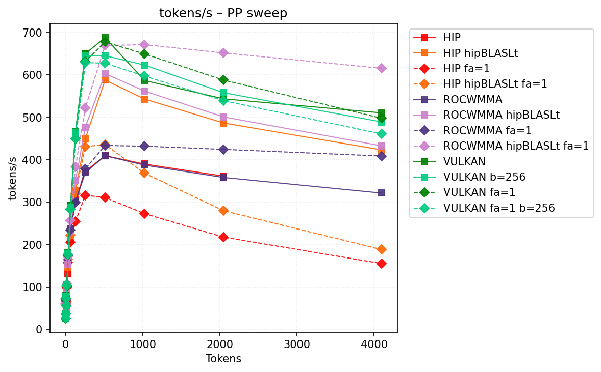
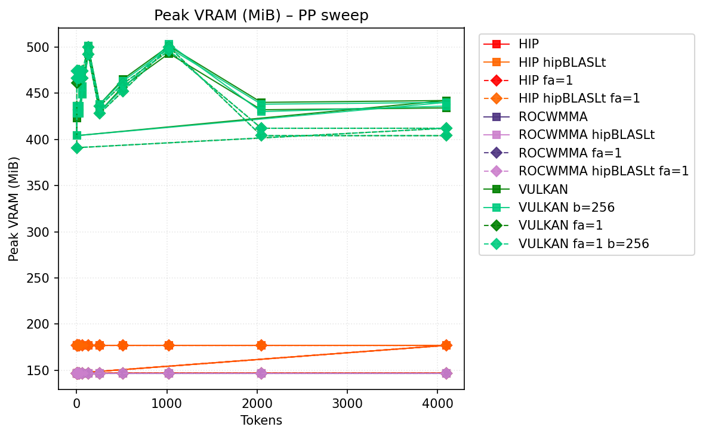
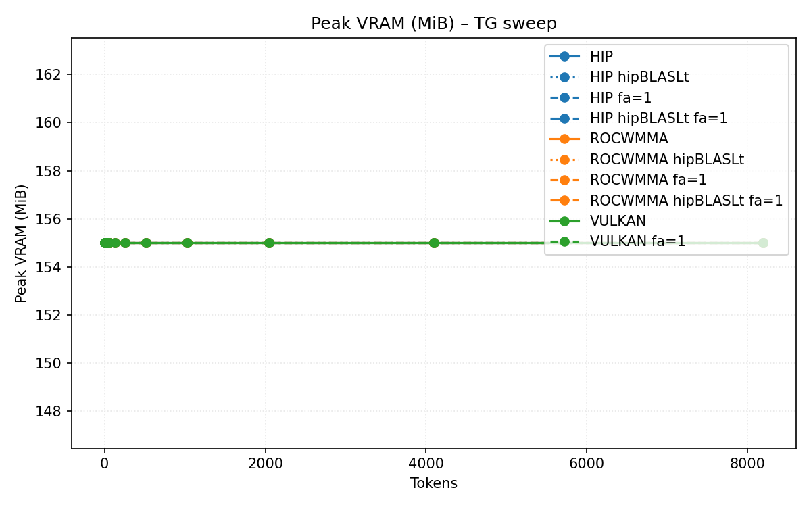

# Benchmark Results
| backend           | hipblaslt   | -fa   | -b     | pp512          | tg128         | max_mem   |
|-------------------|-------------|-------|--------|----------------|---------------|-----------|
| llama.cpp-hip     |             |       |        | 409.600584     | 60.81822      | 18256     |
| llama.cpp-hip     | 1           |       |        | 588.073404     | 61.041616     | 18291     |
| llama.cpp-hip     |             | -fa 1 |        | 311.039229     | 60.816206     | 17737     |
| llama.cpp-hip     | 1           | -fa 1 |        | 436.02087      | 60.56865      | 17769     |
| llama.cpp-rocwmma |             |       |        | 409.57599      | 60.153791     | 18236     |
| llama.cpp-rocwmma | 1           |       |        | 603.259717     | 60.148703     | 18268     |
| llama.cpp-rocwmma |             | -fa 1 |        | 433.741049     | 58.477492     | 17676     |
| llama.cpp-rocwmma | 1           | -fa 1 |        | 669.425419     | 58.488832     | 17708     |
| llama.cpp-vulkan  |             |       |        | **687.906943** | 77.959043     | 17729     |
| llama.cpp-vulkan  |             |       | -b 256 | 645.541262     | **77.959366** | 17574     |
| llama.cpp-vulkan  |             | -fa 1 |        | 677.838182     | 72.568419     | 17701     |
| llama.cpp-vulkan  |             | -fa 1 | -b 256 | 627.671531     | 72.544537     | **17543** |
## Performance Charts

### Tokens/s Performance

### Memory Usage

## Detailed Sweeps

### PP sweep
| backend           | hipblaslt   | -fa   | -b     | 1             | 2             | 4             | 8             | 16             | 32             | 64             | 128            | 256            | 512            | 1024           | 2048           |    4096 |
|-------------------|-------------|-------|--------|---------------|---------------|---------------|---------------|----------------|----------------|----------------|----------------|----------------|----------------|----------------|----------------|---------|
| llama.cpp-hip     |             |       |        | 61.89977      | **62.062324** | **75.167087** | 70.001163     | 104.208832     | 131.701348     | 237.931089     | 304.838551     | 372.878237     | 409.600584     | 389.87139      | 361.44135      | nan     |
| llama.cpp-hip     | 1           |       |        | 61.961231     | 60.180757     | 74.419725     | 44.855673     | 77.965553      | 145.758834     | 210.792014     | 327.099061     | 449.717865     | 588.073404     | 543.295718     | 486.870445     | 423.376 |
| llama.cpp-hip     |             | -fa 1 |        | 60.789871     | 59.594212     | 72.0389       | 64.734739     | 99.164293      | 157.106995     | 205.575185     | 254.431591     | 316.36407      | 311.039229     | 273.025714     | 217.612154     | 155.357 |
| llama.cpp-hip     | 1           | -fa 1 |        | 60.800514     | 59.889647     | 70.643721     | 66.717836     | 102.537572     | 164.927606     | 222.384287     | 321.230857     | 431.00197      | 436.02087      | 368.252575     | 279.957546     | 188.261 |
| llama.cpp-rocwmma |             |       |        | 61.446323     | 61.320002     | 72.688426     | 71.316654     | 105.724131     | 169.782807     | 236.863574     | 301.067618     | 369.886053     | 409.57599      | 387.407228     | 358.292829     | 321.517 |
| llama.cpp-rocwmma | 1           |       |        | 61.292949     | 61.883897     | 74.713466     | 53.294918     | 89.761037      | 152.182501     | 231.086387     | 350.456361     | 477.238846     | 603.259717     | 561.962556     | 501.151272     | 432.93  |
| llama.cpp-rocwmma |             | -fa 1 |        | 58.335698     | 60.762339     | 70.419982     | 68.450743     | 101.789257     | 173.80596      | 234.427004     | 299.650716     | 378.628417     | 433.741049     | 432.04224      | 424.53785      | 408.923 |
| llama.cpp-rocwmma | 1           | -fa 1 |        | 58.339182     | 60.230231     | 73.832056     | **71.902968** | **107.399714** | 170.322197     | 256.709488     | 383.304214     | 522.642229     | 669.425419     | **671.635018** | **652.034411** | 615.832 |
| llama.cpp-vulkan  |             |       |        | **79.060091** | 27.154291     | 37.631125     | 56.257585     | 105.452925     | **180.242566** | **292.718706** | **466.336689** | **650.379646** | **687.906943** | 586.911516     | 543.736137     | 510.67  |
| llama.cpp-vulkan  |             |       | -b 256 | 78.732165     | 27.131913     | 37.766972     | 56.171287     | 105.069474     | 179.59977      | 288.956272     | 463.198965     | 644.810565     | 645.541262     | 623.392091     | 558.204639     | 489.27  |
| llama.cpp-vulkan  |             | -fa 1 |        | 72.897353     | 26.153859     | 36.686775     | 55.056082     | 102.942556     | 176.129207     | 283.827002     | 449.67303      | 631.752709     | 677.838182     | 649.704015     | 588.048481     | 497.965 |
| llama.cpp-vulkan  |             | -fa 1 | -b 256 | 72.983327     | 26.214782     | 36.816308     | 55.064904     | 103.123413     | 176.664282     | 283.569409     | 450.150435     | 629.191445     | 627.671531     | 597.44639      | 539.34034      | 461.142 |
### TG sweep
| backend           | hipblaslt   | -fa   | -b     | 1             | 2             | 4             | 8             | 16            | 32           | 64            | 128           | 256           | 512           | 1024                  | 2048          | 4096          |
|-------------------|-------------|-------|--------|---------------|---------------|---------------|---------------|---------------|--------------|---------------|---------------|---------------|---------------|-----------------------|---------------|---------------|
| llama.cpp-hip     |             |       |        | 61.992997     | 62.149874     | 61.895709     | 61.99371      | 61.661616     | 62.267841    | 61.541351     | 60.81822      | 59.839693     | 57.529686     | 54.347817             | 48.625986     | 40.831729     |
| llama.cpp-hip     | 1           |       |        | 62.377112     | 62.006761     | 62.090039     | 62.021479     | 61.852626     | 61.930229    | 61.582499     | 61.041616     | 59.919279     | 57.587771     | 54.390935             | 48.782628     | 40.914832     |
| llama.cpp-hip     |             | -fa 1 |        | 60.490015     | 60.530717     | 60.629424     | 60.726986     | 60.700118     | 60.489019    | 60.574621     | 60.816206     | 60.730761     | 60.510568     | 59.038884             | 56.786651     | 52.630223     |
| llama.cpp-hip     | 1           | -fa 1 |        | 60.757028     | 60.460925     | 60.603735     | 60.697491     | 60.66862      | 60.73272     | 60.809627     | 60.56865      | 60.69376      | 60.586338     | 59.001171             | 56.889274     | 52.67289      |
| llama.cpp-rocwmma |             |       |        | 61.326075     | 61.156585     | 61.142865     | 61.150414     | 61.183528     | 61.084361    | 60.8738       | 60.153791     | 58.846772     | 56.360799     | 53.248191             | 47.700476     | 39.940403     |
| llama.cpp-rocwmma | 1           |       |        | 61.237852     | 61.149817     | 61.340545     | 61.183012     | 61.165889     | 61.217118    | 60.900609     | 60.148703     | 58.88616      | 56.43956      | 53.291922             | 47.705518     | 39.963669     |
| llama.cpp-rocwmma |             | -fa 1 |        | 58.445738     | 58.229635     | 58.193907     | 58.408083     | 58.421897     | 58.44026     | 58.521296     | 58.477492     | 58.148331     | 56.745645     | 55.991268             | 52.117071     | 45.867114     |
| llama.cpp-rocwmma | 1           | -fa 1 |        | 58.138862     | 58.165893     | 58.51276      | 58.400534     | 58.320454     | 58.328478    | 58.448645     | 58.488832     | 58.503997     | 56.823037     | 55.956139             | 52.063        | 46.009396     |
| llama.cpp-vulkan  |             |       |        | **79.076026** | **78.748579** | **78.518842** | 78.003013     | **78.661763** | **78.57877** | 78.117493     | 77.959043     | 77.371242     | 76.393508     | 73.836248             | 67.410081     | 61.455593     |
| llama.cpp-vulkan  |             |       | -b 256 | 79.031187     | 77.845537     | 78.297565     | **78.773581** | 78.435493     | 78.435766    | **78.127937** | **77.959366** | **77.429182** | **76.633547** | **73.91199399999999** | 68.009495     | 61.569497     |
| llama.cpp-vulkan  |             | -fa 1 |        | 72.896553     | 72.621333     | 72.28854      | 72.536243     | 72.826791     | 72.814465    | 72.601038     | 72.568419     | 72.486144     | 72.086577     | 71.557843             | **69.007329** | 64.077284     |
| llama.cpp-vulkan  |             | -fa 1 | -b 256 | 73.065357     | 72.559159     | 72.333492     | 72.512086     | 72.741574     | 72.777285    | 72.629698     | 72.544537     | 72.524659     | 72.096707     | 71.274266             | 68.823202     | **64.298979** |