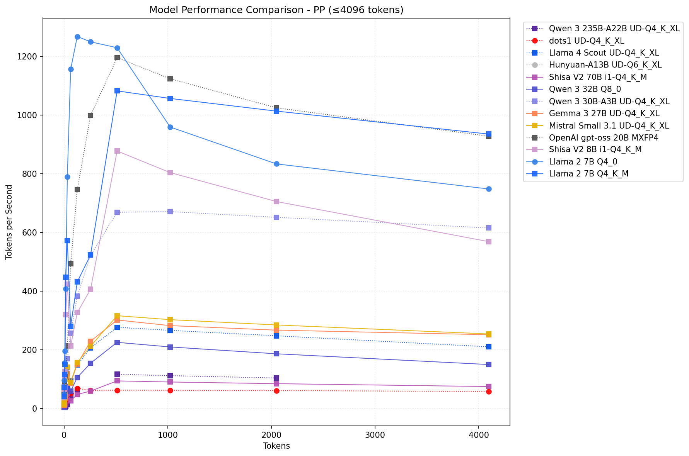
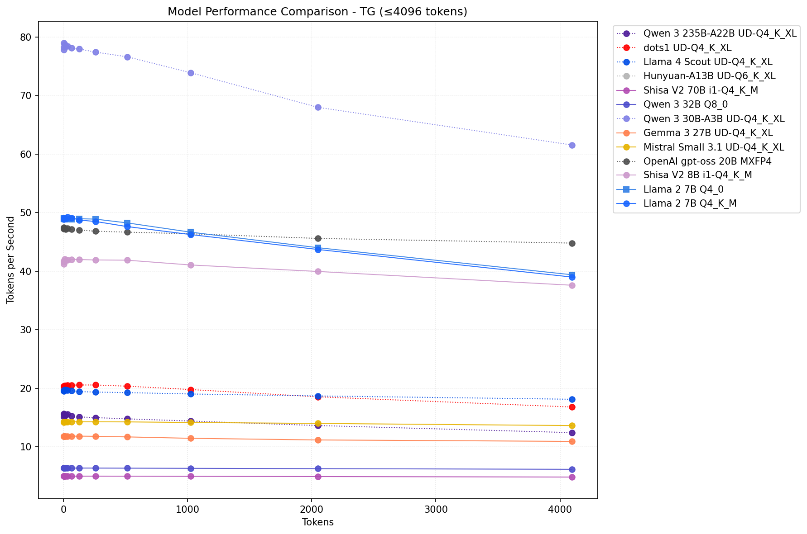

# Strix Halo LLM Benchmark Results

All testing was done on pre-production [Framework Desktop](https://frame.work/desktop) systems with an [AMD Ryzen Max+ 395](https://www.amd.com/en/products/processors/laptop/ryzen/ai-300-series/amd-ryzen-ai-max-plus-395.html) (Strix Halo)/128GB LPDDR5x-8000 configuration. (Thanks Nirav, Alexandru, and co!)

Exact testing/system details are in the results folders, but roughly these are running:
- Close to production BIOS/EC
- Relatively up-to-date kernels: 6.15.5-arch1-1/6.15.6-arch1-1
- Recent TheRock/ROCm-7.0 [nightly builds](https://github.com/ROCm/TheRock/releases/) with Strix Halo (gfx1151) kernels
- Recent [llama.cpp](https://github.com/ggml-org/llama.cpp/) builds (eg [b5863](https://github.com/ggml-org/llama.cpp/tree/b5863) from 2005-07-10)

Just to get a ballpark on the hardware:
- ~215 GB/s max GPU MBW out of a 256 GB/s theoretical (256-bit 8000 MT/s)
- theoretical 59 FP16 TFLOPS (VPOD/WMMA) on RDNA 3.5 (gfx11); effective is *much* lower

## Setup

### GPU Memory
For maximum performance, you should `amd_iommu=off` in your kernel - on memtest_vulkan, this translates to about 6% faster memory reads, although llama.cpp performance tends to be smaller (~2% or less for tg). Still, free performance is free performance. Note, `iommu=pt` does not give any speed benefit.

The other thing you want to do is to set the the GPU memory settings. Here's how to allocate 120GB of memory as GTT GPU memory. Set your GPU memory in BIOS (GART) to the minimum 512MB buffer. In Linux, create a conf in your `/etc/modprobe.d/` (like `/etc/modprobe.d/amdgpu_llm_optimized.conf`):

```
# Maximize GTT for LLM usage on 128GB UMA system
options amdgpu gttsize=120000
options ttm pages_limit=31457280
options ttm page_pool_size=15728640
```

The Translation Table Maps (TTM) is the memory management subsystem that handles GPU memory allocation. `pages_limit` sets the maximum number or 4KiB pages that can be used for GPU memory. `page_pool_size` pre-caches/allocates the memory for usage by the GPU. This will not be available for your system. You probably don't want to set it too high if you will be using the system for other purposes/need memory.

### Vulkan
There are multiple [Vulkan libraries](https://wiki.archlinux.org/title/Vulkan) available for AMD and I recommend installing at least two of them. If you're using Arch I recommend:

```
paru -S vulkan-radeon amdvlk vulkan-headers vulkan-tools
```

`amdvlk` (AMDVLK Open) will be used by default and in general seems to be faster than `vulkan-radeon` (Mesa RADV). When both are installed, AMDVLK is used by default, but you can use this env variable: `AMD_VULKAN_ICD=RADV` to use Mesa RADV to test.

I've seen anywhere from no difference to 2X difference in pp performance (AMDVLK always seems to be faster) in limited testing although this may change depending on updates to the libraries. I don't swap Vulkan libs on my current sweeps but it's something to consider in the future...

### ROCm
Instead of using the [ROCm AUR packages](https://wiki.archlinux.org/title/GPGPU#ROCm) it's probably best for now to be using the [latest releases from TheRock](https://github.com/ROCm/TheRock/releases). You can simply make a folder (like `/opt/rocm`) and untar a `gfx1151` release in that.

```
# See latest nightlies
wget https://github.com/ROCm/TheRock/releases/download/nightly-tarball/therock-dist-linux-gfx1151-7.0.0rc20250714.tar.gz
mkdir rocm7.0
cd rocm7.0
tar xvf ../therock-dist-linux-gfx1151-7.0.0rc20250714.tar.gz
```

- You might want to install a gfx110x version first if you want gfx1100 kernels to test as well

- You can choose wherever you want to put it and refer to [rocm-therock-env.sh](../rocm-therock-env.sh) for how to load the appropriate environment variables

### llama.cpp
You can reference the `[llama-cpp-bencher.py](llama-cpp-bencher.py)` directly for more info, but a few notes:

- There is an [update-llama.cpp.sh](update-llama.cpp.sh) convenience script, but refer to the [official llama.cpp build docs](https://github.com/ggml-org/llama.cpp/blob/master/docs/build.md) for the latest/most authoritative documentation
  - When compiling the ROCm/HIP backend, you may need to tweak `ggml/src/ggml-cuda/vendors/hip.h` if you get a compilation error - The #ifdef versioning used is wrong (deprecations were with 6.5 on) - you might also just need/want to copy the fixed macros into the else statement...
- For the ROCm backend, generally using the hipblaslt libs will be faster, using the `ROCBLAS_USE_HIPBLASLT=1` environment variable
- As mentioned, in my testing the AMDVLK Vulkan implementation seems to always be faster, although you can use `AMD_VULKAN_ICD=RADV` if necessary to use the Mesa RADV Vulkan if you have both installed
- Be sure to disable mmap, eg `--mmap 0` for `llama-bench` or `--no-mmap` for `llama-cli` or `llama-server` otherwise you may incur extreme model loading speed penalties with the ROCm backend if exceeding 50% of the available system memory

## Results

### Prompt Processing (pp) Performance


| Model Name                   | Architecture   |   Weights (B) |   Active (B) | Backend     | Flags          |   pp512 |   tg128 |   Memory (Max MiB) |
|------------------------------|----------------|---------------|--------------|-------------|----------------|---------|---------|--------------------|
| dots1 UD-Q4_K_XL             | dots1 MoE      |           142 |           14 | Vulkan      | fa=1 b=256     |   nan   |   nan   |                161 |
| Llama 4 Scout UD-Q4_K_XL     | Llama 4 MoE    |           109 |           17 | HIP         | hipBLASLt      |   nan   |   nan   |                161 |
| Hunyuan-A13B UD-Q6_K_XL      | Hunyuan MoE    |            80 |           13 | Vulkan      | fa=1           |   nan   |   nan   |                161 |
| Llama 2 7B Q4_0              | Llama 2        |             7 |            7 | Vulkan      |                |  1230.0 |    48.3 |               4323 |
| Llama 2 7B Q4_K_M            | Llama 2        |             7 |            7 | HIP rocWMMA | fa=1 hipBLASLt |  1083.0 |    41.3 |               4720 |
| Shisa V2 8B i1-Q4_K_M        | Llama 3        |             8 |            8 | HIP         | hipBLASLt      |   878.2 |    37.2 |               5308 |
| Mistral Small 3.1 UD-Q4_K_XL | Mistral 3      |            24 |           24 | HIP         | hipBLASLt      |   316.9 |    13.6 |              14638 |
| Gemma 3 27B UD-Q4_K_XL       | Gemma 3        |            27 |           27 | HIP         | hipBLASLt      |   302.2 |    10.7 |              17542 |
| Qwen 3 32B Q8_0              | Qwen 3         |            32 |           32 | HIP         | hipBLASLt      |   226.1 |     6.4 |              33683 |
| Qwen 3 235B-A22B UD-Q4_K_XL  | Qwen 3 MoE     |           235 |           22 | HIP         | hipBLASLt      |   117.1 |    12.9 |              99950 |
| Shisa V2 70B i1-Q4_K_M       | Llama 3        |            70 |           70 | HIP rocWMMA | hipBLASLt      |    94.7 |     4.5 |              41522 |

### Text Generation (tg) Performance


| Model Name                   | Architecture   |   Weights (B) |   Active (B) | Backend   | Flags          |   pp512 |   tg128 |   Memory (Max MiB) |
|------------------------------|----------------|---------------|--------------|-----------|----------------|---------|---------|--------------------|
| dots1 UD-Q4_K_XL             | dots1 MoE      |           142 |           14 | Vulkan    | fa=1 b=256     |   nan   |   nan   |                161 |
| Llama 4 Scout UD-Q4_K_XL     | Llama 4 MoE    |           109 |           17 | Vulkan    | fa=1 b=256     |   nan   |   nan   |                161 |
| Hunyuan-A13B UD-Q6_K_XL      | Hunyuan MoE    |            80 |           13 | Vulkan    | fa=1 b=256     |   nan   |   nan   |                161 |
| Qwen 3 30B-A3B UD-Q4_K_XL    | Qwen 3 MoE     |            30 |            3 | Vulkan    | b=256          |   645.5 |    78.0 |              17377 |
| Llama 2 7B Q4_0              | Llama 2        |             7 |            7 | HIP       | fa=1 hipBLASLt |   975.3 |    49.4 |               4429 |
| Llama 2 7B Q4_K_M            | Llama 2        |             7 |            7 | Vulkan    | fa=1           |   787.6 |    48.7 |               4463 |
| Shisa V2 8B i1-Q4_K_M        | Llama 3        |             8 |            8 | Vulkan    | fa=1           |   614.2 |    42.0 |               5333 |
| Qwen 3 235B-A22B UD-Q4_K_XL  | Qwen 3 MoE     |           235 |           22 | Vulkan    | fa=1           |   109.5 |    15.1 |             100446 |
| Mistral Small 3.1 UD-Q4_K_XL | Mistral 3      |            24 |           24 | Vulkan    | fa=1           |   119.6 |    14.3 |              14540 |
| Gemma 3 27B UD-Q4_K_XL       | Gemma 3        |            27 |           27 | Vulkan    | fa=1           |   114.7 |    11.8 |              18123 |
| Qwen 3 32B Q8_0              | Qwen 3         |            32 |           32 | Vulkan    | fa=1           |   101.8 |     6.4 |              33886 |
| Shisa V2 70B i1-Q4_K_M       | Llama 3        |            70 |           70 | Vulkan    | fa=1           |    26.4 |     5.0 |              41456 |


## Testing Notes
The best overall backend and flags were chosen for each model family tested. You can see that often times the best backend for prefill vs token generation differ. Full results for each model (including the pp/tg graphs for different context lengths for all tested backend variations) are available for review in their respective folders as which backend is the best performing will depend on your exact use-case.

There's a lot of performance still on the table when it comes to pp especially. Since these results should be close to optimal for when they were tested, I might add dates to the table  (adding kernel, ROCm, and llama.cpp build#'s might be a bit much).
