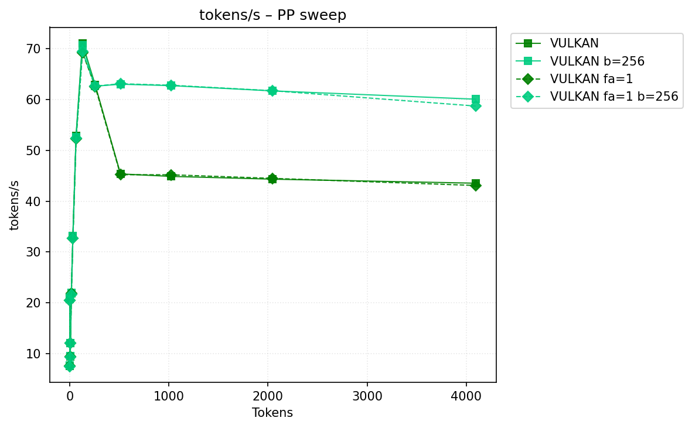
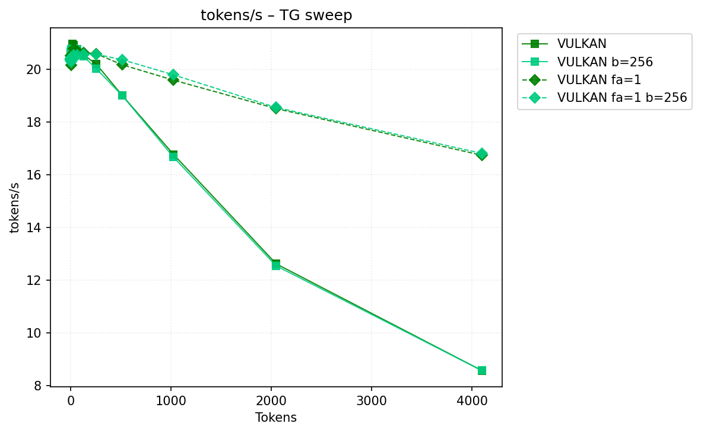
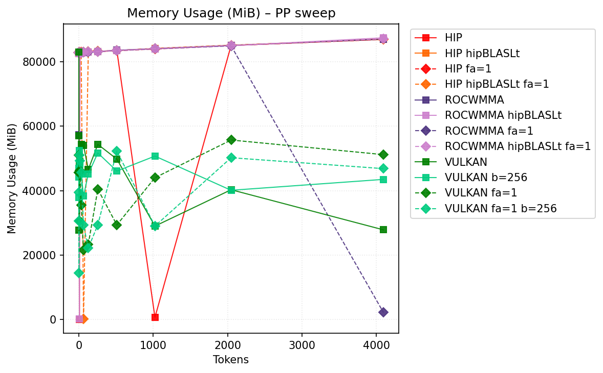
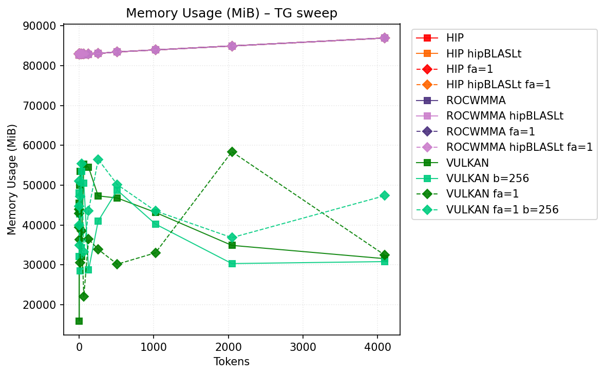

# Benchmark Results
| backend           | hipblaslt   | -fa   | -b     |   pp512 | tg128         | max_mem   |
|-------------------|-------------|-------|--------|---------|---------------|-----------|
| llama.cpp-hip     |             |       |        | nan     | 19.191936     | 87090     |
| llama.cpp-hip     | 1           |       |        | nan     | 19.209453     | 87147     |
| llama.cpp-hip     |             | -fa 1 |        | nan     | 19.03275      | 87000     |
| llama.cpp-hip     | 1           | -fa 1 |        | nan     | 19.115542     | 87031     |
| llama.cpp-rocwmma |             |       |        | nan     | 18.929991     | 87090     |
| llama.cpp-rocwmma | 1           |       |        | nan     | 18.824714     | 87512     |
| llama.cpp-rocwmma |             | -fa 1 |        | nan     | 18.478192     | 86926     |
| llama.cpp-rocwmma | 1           | -fa 1 |        | nan     | 18.594553     | 87151     |
| llama.cpp-vulkan  |             |       |        | 181.302 | **22.302831** | 83153     |
| llama.cpp-vulkan  |             |       | -b 256 | 138.276 | 22.271341     | **53453** |
| llama.cpp-vulkan  |             | -fa 1 |        | 182.026 | 22.122535     | 58394     |
| llama.cpp-vulkan  |             | -fa 1 | -b 256 | 139.104 | 22.104695     | 56483     |
## Performance Charts

### Tokens/s Performance

### Memory Usage

## Detailed Sweeps

### PP sweep
| backend           | hipblaslt   | -fa   | -b     | 1             | 2             |        4 | 8             | 16            | 32            | 64            | 128            |     256 |     512 |    1024 |    2048 |    4096 |
|-------------------|-------------|-------|--------|---------------|---------------|----------|---------------|---------------|---------------|---------------|----------------|---------|---------|---------|---------|---------|
| llama.cpp-hip     |             |       |        | 19.346987     | **20.841608** | nan      | **25.165924** | 28.880501     | 38.797694     | 74.529111     | 95.603469      | nan     | nan     | nan     | nan     | nan     |
| llama.cpp-hip     | 1           |       |        | 19.549319     | nan           | nan      | 20.128036     | 29.419427     | 39.443987     | **85.795472** | **114.868044** | 142.43  | nan     | nan     | nan     | nan     |
| llama.cpp-hip     |             | -fa 1 |        | 19.113437     | nan           | nan      | nan           | 27.637176     | 35.749807     | nan           | nan            | nan     | nan     | nan     | nan     | nan     |
| llama.cpp-hip     | 1           | -fa 1 |        | 19.086313     | 20.816219     | nan      | 19.593698     | 28.888669     | nan           | nan           | nan            | nan     | nan     | nan     | nan     | nan     |
| llama.cpp-rocwmma |             |       |        | 19.046095     | 20.788529     |  24.1577 | 20.242045     | 29.077311     | 37.587711     | 73.857434     | 94.656634      | nan     | nan     | nan     | nan     | nan     |
| llama.cpp-rocwmma | 1           |       |        | 19.41672      | nan           | nan      | 17.051425     | 26.358606     | 37.918406     | 83.895981     | 112.695624     | nan     | nan     | nan     | nan     | 178.95  |
| llama.cpp-rocwmma |             | -fa 1 |        | 18.617524     | 20.355197     | nan      | 18.585504     | 26.517241     | 37.088078     | 73.426768     | 95.00911       | nan     | nan     | nan     | nan     | nan     |
| llama.cpp-rocwmma | 1           | -fa 1 |        | 18.617069     | nan           |  23.5611 | nan           | **30.145652** | 37.693845     | 81.734636     | 113.316862     | nan     | nan     | nan     | nan     | nan     |
| llama.cpp-vulkan  |             |       |        | 22.479        | 8.505982      |  10.7774 | 13.940018     | 25.735342     | 40.067457     | 60.096981     | 95.253296      | 141.324 | 181.302 | 168.134 | 161.011 | 155.539 |
| llama.cpp-vulkan  |             |       | -b 256 | **22.574441** | 8.512455      |  10.7844 | 13.941201     | 25.665028     | **40.093934** | 59.997257     | 95.163815      | 141.192 | 138.276 | 135.038 | 128.572 | 122.37  |
| llama.cpp-vulkan  |             | -fa 1 |        | 22.10141      | 8.349302      |  10.7123 | 13.868326     | 25.515672     | 39.872396     | 60.09158      | 93.864966      | 141.189 | 182.026 | 177.291 | 170.968 | 159.617 |
| llama.cpp-vulkan  |             | -fa 1 | -b 256 | 22.255998     | 8.366402      |  10.7183 | 13.881029     | 25.50233      | 39.8446       | 59.963925     | 94.129181      | 141.371 | 139.104 | 136.44  | 133.173 | 125.843 |
### TG sweep
| backend           | hipblaslt   | -fa   | -b     | 1             | 2             | 4             | 8             | 16            | 32            | 64            | 128           | 256           | 512           | 1024          | 2048          | 4096          |
|-------------------|-------------|-------|--------|---------------|---------------|---------------|---------------|---------------|---------------|---------------|---------------|---------------|---------------|---------------|---------------|---------------|
| llama.cpp-hip     |             |       |        | 19.476402     | 13.148628     | 17.754224     | 16.489918     | 18.893726     | 19.348035     | 18.864532     | 19.191936     | 18.693665     | 17.669936     | 15.480501     | 11.836148     | 8.168706      |
| llama.cpp-hip     | 1           |       |        | 19.484393     | 18.186252     | 15.444612     | 17.40633      | 18.343132     | 19.285859     | 19.190495     | 19.209453     | 18.725759     | 17.576058     | 15.475437     | 11.696004     | 8.185003      |
| llama.cpp-hip     |             | -fa 1 |        | 19.153506     | 17.014042     | 15.828477     | 17.080204     | 17.501669     | 18.794446     | 18.423412     | 19.03275      | 18.855451     | 18.822884     | nan           | nan           | nan           |
| llama.cpp-hip     | 1           | -fa 1 |        | 19.075318     | 19.068863     | 18.45599      | 14.442929     | 18.3477       | 18.329943     | 18.97687      | 19.115542     | 18.80185      | 18.847135     | 18.214215     | nan           | 16.095115     |
| llama.cpp-rocwmma |             |       |        | 19.393358     | 17.220995     | 15.623413     | 18.679536     | 18.336512     | 18.707507     | 18.896292     | 18.929991     | 18.423616     | 17.368036     | 15.266033     | 11.708877     | 8.115074      |
| llama.cpp-rocwmma | 1           |       |        | 19.361033     | 18.094279     | 15.369662     | 16.413197     | 18.013636     | 18.672361     | 18.671254     | 18.824714     | 18.414996     | 17.412099     | 15.268769     | 11.711182     | 8.107214      |
| llama.cpp-rocwmma |             | -fa 1 |        | 18.60538      | 18.532738     | 16.630479     | 17.78099      | 16.721072     | 18.164728     | 17.92984      | 18.478192     | 18.44864      | 18.262727     | 17.695923     | 16.264036     | nan           |
| llama.cpp-rocwmma | 1           | -fa 1 |        | 17.205289     | 10.723117     | 15.486118     | 15.956572     | 17.479123     | 17.784236     | 18.162737     | 18.594553     | 18.52813      | 18.25105      | 17.65621      | 16.321715     | 14.073433     |
| llama.cpp-vulkan  |             |       |        | **22.644615** | **22.698084** | **22.639091** | 22.108458     | 22.277896     | **22.700789** | **22.621395** | **22.302831** | 21.883884     | 20.808555     | 18.252969     | 13.517574     | 8.988484      |
| llama.cpp-vulkan  |             |       | -b 256 | 22.638016     | 22.471026     | 22.399643     | **22.319144** | **22.363248** | 22.477091     | 22.498598     | 22.271341     | 21.827527     | 20.824619     | 18.239411     | 13.517787     | 8.98674       |
| llama.cpp-vulkan  |             | -fa 1 |        | 22.066107     | 22.030923     | 22.082689     | 21.845631     | 22.044303     | 22.154834     | 22.189821     | 22.122535     | 22.040539     | **21.760523** | 21.163595     | **20.103858** | 18.138565     |
| llama.cpp-vulkan  |             | -fa 1 | -b 256 | 22.228403     | 22.083152     | 21.629636     | 21.666788     | 22.043358     | 22.108168     | 22.177607     | 22.104695     | **22.043609** | 21.750426     | **21.183428** | 20.100671     | **18.140132** |