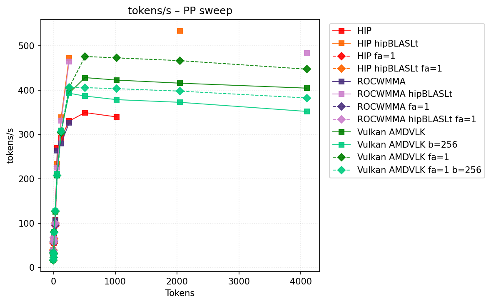
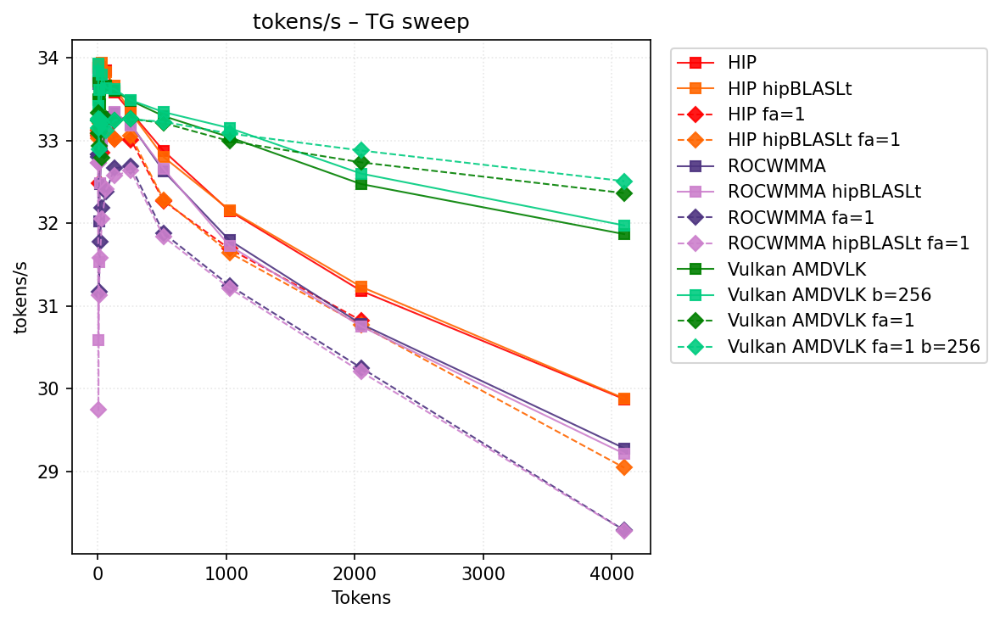
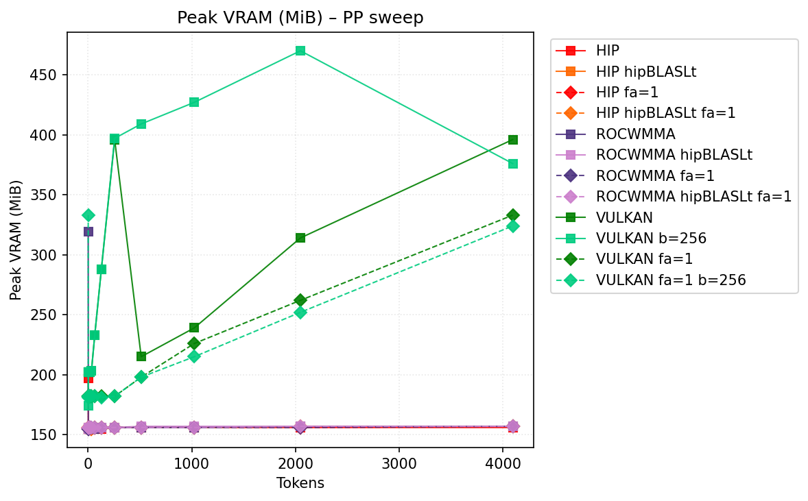
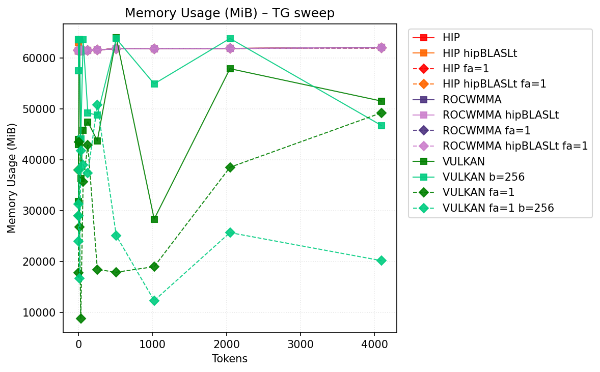

# Benchmark Results
| backend           | hipblaslt   | -fa   | -b     | pp512          | tg128         | max_mem   |
|-------------------|-------------|-------|--------|----------------|---------------|-----------|
| llama.cpp-hip     |             |       |        | 349.57653      | 33.580682     | 62332     |
| llama.cpp-hip     | 1           |       |        | nan            | 33.66161      | 62963     |
| llama.cpp-hip     |             | -fa 1 |        | nan            | 33.021871     | 62086     |
| llama.cpp-hip     | 1           | -fa 1 |        | nan            | 33.016706     | 62116     |
| llama.cpp-rocwmma |             |       |        | nan            | 33.338229     | 62199     |
| llama.cpp-rocwmma | 1           |       |        | nan            | 33.343964     | 63455     |
| llama.cpp-rocwmma |             | -fa 1 |        | nan            | 32.666084     | 62053     |
| llama.cpp-rocwmma | 1           | -fa 1 |        | nan            | 32.572769     | 62085     |
| llama.cpp-vulkan  |             |       |        | **430.564331** | **33.680159** | 63979     |
| llama.cpp-vulkan  |             |       | -b 256 | 386.805211     | 33.662372     | 63831     |
| llama.cpp-vulkan  |             | -fa 1 |        | nan            | nan           | 55197     |
| llama.cpp-vulkan  |             | -fa 1 | -b 256 | nan            | nan           | **50745** |
## Performance Charts

### Tokens/s Performance

### Memory Usage

## Detailed Sweeps

### PP sweep
| backend           | hipblaslt   | -fa   | -b     | 1             | 2             | 4             | 8             | 16            | 32             | 64             | 128            | 256            | 512            | 1024           |    2048 |    4096 |
|-------------------|-------------|-------|--------|---------------|---------------|---------------|---------------|---------------|----------------|----------------|----------------|----------------|----------------|----------------|---------|---------|
| llama.cpp-hip     |             |       |        | 33.413708     | 39.302351     | 55.834519     | 63.466762     | 66.455436     | 107.581328     | **269.283019** | 293.390577     | 330.358749     | 349.57653      | 339.731228     | nan     | nan     |
| llama.cpp-hip     | 1           |       |        | 33.861094     | 39.289925     | 59.680689     | nan           | 61.81031      | 94.777603      | 233.427749     | **339.396212** | **472.862339** | nan            | nan            | 534.07  | nan     |
| llama.cpp-hip     |             | -fa 1 |        | 33.129274     | 38.247544     | 54.669823     | nan           | nan           | 94.043875      | nan            | nan            | nan            | nan            | nan            | nan     | nan     |
| llama.cpp-hip     | 1           | -fa 1 |        | 33.069765     | **39.328072** | 56.426876     | nan           | 65.094159     | 100.815122     | nan            | nan            | nan            | nan            | nan            | nan     | nan     |
| llama.cpp-rocwmma |             |       |        | 31.93391      | 38.082745     | 57.045501     | 61.462331     | 62.124315     | 106.320872     | 263.474104     | 280.151751     | 326.276123     | nan            | nan            | nan     | nan     |
| llama.cpp-rocwmma | 1           |       |        | 33.763132     | 38.781475     | **60.013724** | nan           | 59.278902     | 95.127856      | 224.967771     | 331.251826     | 464.390426     | nan            | nan            | nan     | 484.032 |
| llama.cpp-rocwmma |             | -fa 1 |        | 32.832914     | 37.534864     | 57.49268      | 59.547448     | nan           | 96.023144      | nan            | nan            | nan            | nan            | nan            | nan     | nan     |
| llama.cpp-rocwmma | 1           | -fa 1 |        | 32.753319     | 37.799481     | 57.808436     | **67.346393** | 61.548042     | 99.42683       | nan            | nan            | nan            | nan            | nan            | nan     | nan     |
| llama.cpp-vulkan  |             |       |        | **33.912286** | 16.640172     | 23.437407     | 29.680732     | **82.415106** | **128.114994** | 211.086995     | 310.565503     | 393.502709     | **430.564331** | **421.696245** | 419.409 | 405.653 |
| llama.cpp-vulkan  |             |       | -b 256 | 33.852812     | 16.66127      | 22.834293     | 30.847854     | 80.490419     | 123.307057     | 209.445804     | 308.30738      | 392.86348      | 386.805211     | 379.727358     | 372.608 | 353.418 |
| llama.cpp-vulkan  |             | -fa 1 |        | nan           | nan           | nan           | nan           | nan           | nan            | nan            | nan            | nan            | nan            | nan            | nan     | nan     |
| llama.cpp-vulkan  |             | -fa 1 | -b 256 | nan           | nan           | nan           | nan           | nan           | nan            | nan            | nan            | nan            | nan            | nan            | nan     | nan     |
### TG sweep
| backend           | hipblaslt   | -fa   | -b     | 1             | 2             | 4             | 8             | 16            | 32            | 64            | 128           | 256          | 512           | 1024          | 2048          | 4096          |
|-------------------|-------------|-------|--------|---------------|---------------|---------------|---------------|---------------|---------------|---------------|---------------|--------------|---------------|---------------|---------------|---------------|
| llama.cpp-hip     |             |       |        | **33.915653** | 33.873955     | **33.882845** | 33.056968     | **33.884999** | 33.734238     | **33.851438** | 33.580682     | 33.342844    | 32.873097     | 32.148113     | 31.182359     | 29.872014     |
| llama.cpp-hip     | 1           |       |        | 33.883416     | 33.899217     | 33.882749     | **33.905856** | 33.846601     | **33.939372** | 33.827031     | 33.66161      | 33.336163    | 32.799501     | 32.160244     | 31.231511     | 29.88094      |
| llama.cpp-hip     |             | -fa 1 |        | 33.05654      | 33.086652     | 33.117936     | 32.486003     | 33.157097     | 32.854373     | 33.138727     | 33.021871     | 33.010427    | 32.267232     | 31.689837     | 30.823485     | nan           |
| llama.cpp-hip     | 1           | -fa 1 |        | 33.073439     | 33.131756     | 33.031318     | 33.141898     | 33.207966     | 33.05932      | 33.093892     | 33.016706     | 33.056693    | 32.282175     | 31.643798     | 30.766085     | 29.042691     |
| llama.cpp-rocwmma |             |       |        | 33.688288     | 33.76455      | 33.794594     | 32.025919     | 32.470549     | 32.931133     | 33.286294     | 33.338229     | 33.193913    | 32.628363     | 31.79383      | 30.780796     | 29.278087     |
| llama.cpp-rocwmma | 1           |       |        | 33.803333     | 33.717636     | 30.584545     | 31.524978     | 32.487811     | 32.984038     | 33.173377     | 33.343964     | 33.18592     | 32.653755     | 31.728417     | 30.752909     | 29.212711     |
| llama.cpp-rocwmma |             | -fa 1 |        | 32.833693     | 32.832333     | 32.796612     | 31.175828     | 31.77611      | 32.185628     | 32.37876      | 32.666084     | 32.690688    | 31.878137     | 31.246987     | 30.251288     | 28.286826     |
| llama.cpp-rocwmma | 1           | -fa 1 |        | 32.734078     | 32.731022     | 29.740663     | 31.131719     | 31.580707     | 32.054258     | 32.413237     | 32.572769     | 32.634016    | 31.834113     | 31.215277     | 30.202557     | 28.283418     |
| llama.cpp-vulkan  |             |       |        | 33.720562     | 33.786864     | 33.874479     | 33.817109     | 33.830068     | 33.838809     | 33.766005     | **33.680159** | 33.519501    | 33.395511     | 33.121913     | 32.553958     | 31.9427       |
| llama.cpp-vulkan  |             |       | -b 256 | 33.803503     | **33.899489** | 33.82345      | 33.825511     | 33.834645     | 33.822907     | 33.728819     | 33.662372     | **33.52439** | **33.424046** | **33.220283** | **32.666791** | **32.042539** |
| llama.cpp-vulkan  |             | -fa 1 |        | nan           | nan           | nan           | nan           | nan           | nan           | nan           | nan           | nan          | nan           | nan           | nan           | nan           |
| llama.cpp-vulkan  |             | -fa 1 | -b 256 | nan           | nan           | nan           | nan           | nan           | nan           | nan           | nan           | nan          | nan           | nan           | nan           | nan           |