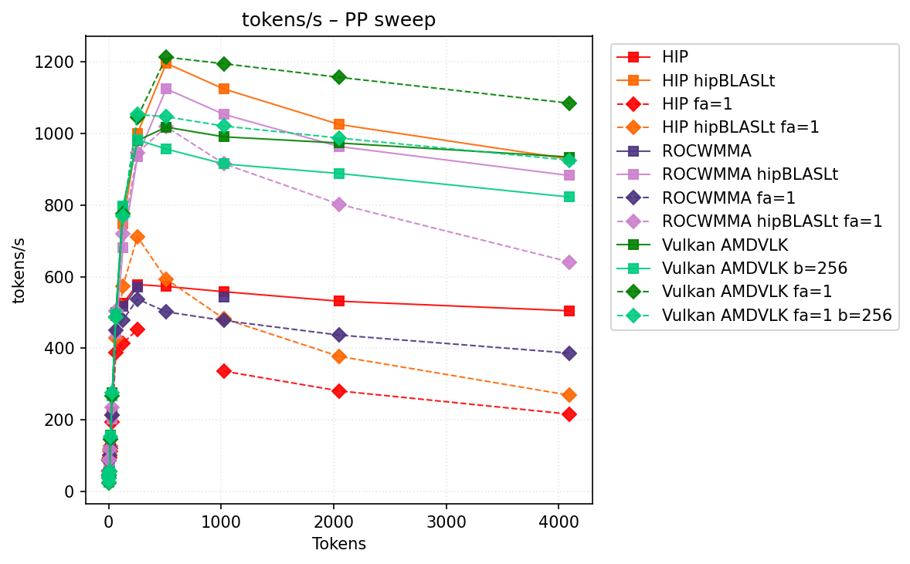
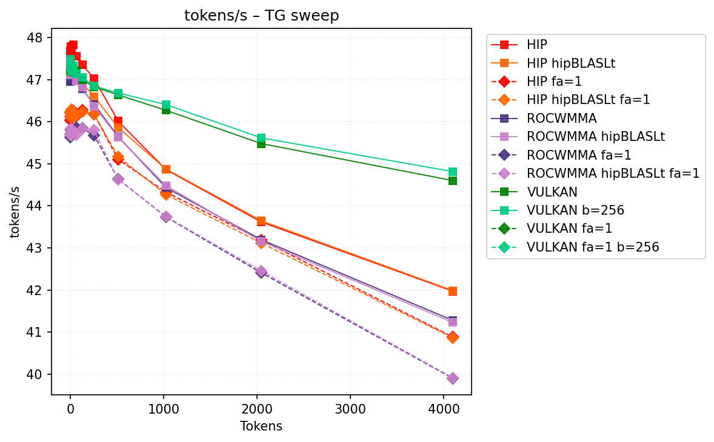
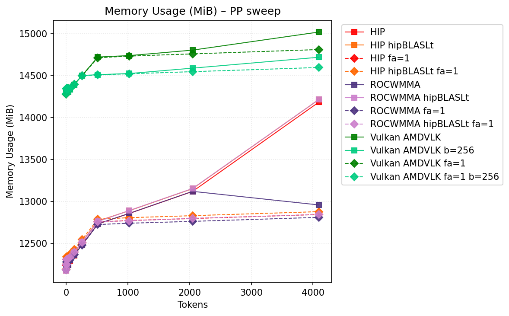
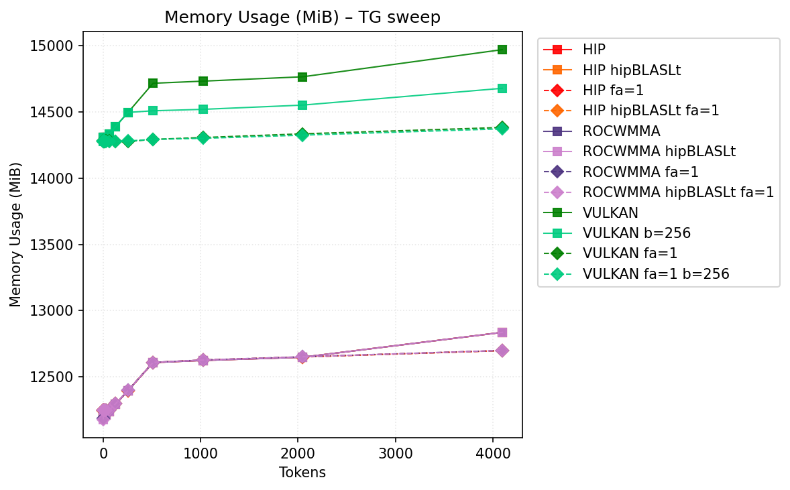

# Benchmark Results
| backend                 | hipblaslt   | -fa   | -b     | pp512           | tg128      | max_mem   |
|-------------------------|-------------|-------|--------|-----------------|------------|-----------|
| llama.cpp-hip           |             |       |        | 572.571609      | **47.357** | 14186     |
| llama.cpp-hip           | 1           |       |        | 1196.176521     | 46.919194  | 14217     |
| llama.cpp-hip           |             | -fa 1 |        | nan             | 46.280287  | 12845     |
| llama.cpp-hip           | 1           | -fa 1 |        | 592.717185      | 46.230567  | 12879     |
| llama.cpp-rocwmma       |             |       |        | nan             | 46.776844  | 13121     |
| llama.cpp-rocwmma       | 1           |       |        | 1124.695692     | 46.814524  | 14217     |
| llama.cpp-rocwmma       |             | -fa 1 |        | 501.464849      | 45.840796  | **12811** |
| llama.cpp-rocwmma       | 1           | -fa 1 |        | 1018.608448     | 45.831103  | 12845     |
| llama.cpp-vulkan_amdvlk |             |       |        | 1017.684079     | 47.097424  | 15022     |
| llama.cpp-vulkan_amdvlk |             |       | -b 256 | 956.539278      | 47.092975  | 14721     |
| llama.cpp-vulkan_amdvlk |             | -fa 1 |        | **1213.262164** | 46.510093  | 14813     |
| llama.cpp-vulkan_amdvlk |             | -fa 1 | -b 256 | 1046.686632     | 46.527128  | 14599     |
## Performance Charts

### Tokens/s Performance

### Memory Usage

## Detailed Sweeps

### PP sweep
| backend                 | hipblaslt   | -fa   | -b     | 1             | 2             | 4             | 8              | 16             | 32             | 64           | 128            | 256             | 512             | 1024            | 2048            | 4096            |
|-------------------------|-------------|-------|--------|---------------|---------------|---------------|----------------|----------------|----------------|--------------|----------------|-----------------|-----------------|-----------------|-----------------|-----------------|
| llama.cpp-hip           |             |       |        | 47.000315     | 56.630286     | 89.781336     | 104.65175      | 119.775972     | 222.034344     | 498.704712   | 524.858455     | 577.753738      | 572.571609      | 557.802961      | 531.267483      | 504.452455      |
| llama.cpp-hip           | 1           |       |        | 47.157912     | 57.238034     | 93.660759     | 101.339423     | 122.03519      | 209.008897     | 494.640607   | 746.7199       | 999.696677      | 1196.176521     | 1124.299827     | 1025.27782      | 928.493158      |
| llama.cpp-hip           |             | -fa 1 |        | 46.100082     | 55.892396     | 90.562064     | 94.104441      | 112.120943     | 194.377011     | 388.135148   | 413.949921     | 452.391794      | nan             | 335.762844      | 280.598916      | 215.608619      |
| llama.cpp-hip           | 1           | -fa 1 |        | 46.128252     | 56.668752     | 89.771688     | 112.181877     | 127.23867      | 213.804799     | 428.106906   | 574.135408     | 711.473443      | 592.717185      | 482.458552      | 377.09174       | 268.511389      |
| llama.cpp-rocwmma       |             |       |        | 47.10173      | 56.675948     | 89.633498     | 101.277838     | 125.715206     | 220.628411     | 494.624014   | 516.01592      | 571.119634      | nan             | 543.783166      | nan             | nan             |
| llama.cpp-rocwmma       | 1           |       |        | 47.139924     | 55.966694     | **93.681409** | 85.478261      | 109.429437     | 202.511233     | 442.621048   | 680.574724     | 935.176702      | 1124.695692     | 1053.382269     | 963.513701      | 882.47765       |
| llama.cpp-rocwmma       |             | -fa 1 |        | 45.645741     | **57.575226** | 86.520318     | 101.314165     | 119.714341     | 212.449075     | 450.170149   | 478.68582      | 537.415687      | 501.464849      | 477.271541      | 436.617001      | 386.162602      |
| llama.cpp-rocwmma       | 1           | -fa 1 |        | 45.777815     | 55.800512     | 88.281971     | **117.731887** | 143.396956     | 234.393584     | **504.7484** | 719.466516     | 946.140743      | 1018.608448     | 915.361692      | 802.211918      | 640.937585      |
| llama.cpp-vulkan_amdvlk |             |       |        | **47.461533** | 26.14176      | 38.030902     | 56.042332      | **156.793166** | **275.661502** | 492.131493   | 793.120689     | 980.087456      | 1017.684079     | 990.640893      | 973.445041      | 934.173916      |
| llama.cpp-vulkan_amdvlk |             |       | -b 256 | 47.432388     | 25.616292     | 37.827677     | 54.938438      | 154.87971      | 266.41763      | 496.328398   | **796.754442** | 982.182335      | 956.539278      | 914.861265      | 888.241569      | 822.295554      |
| llama.cpp-vulkan_amdvlk |             | -fa 1 |        | 45.462787     | 24.328403     | 37.96611      | 55.237198      | 146.669617     | 266.63826      | 486.516646   | 774.944605     | 1045.269698     | **1213.262164** | **1194.822181** | **1157.001776** | **1084.567109** |
| llama.cpp-vulkan_amdvlk |             | -fa 1 | -b 256 | 46.603016     | 25.091415     | 36.435508     | 54.545986      | 153.647837     | 274.795103     | 485.937252   | 769.365723     | **1053.046238** | 1046.686632     | 1020.778546     | 987.201844      | 925.267839      |
### TG sweep
| backend                 | hipblaslt   | -fa   | -b     | 1             | 2             | 4             | 8             | 16           | 32                 | 64            | 128        | 256           | 512           | 1024          | 2048          | 4096          |
|-------------------------|-------------|-------|--------|---------------|---------------|---------------|---------------|--------------|--------------------|---------------|------------|---------------|---------------|---------------|---------------|---------------|
| llama.cpp-hip           |             |       |        | **47.618841** | **47.689726** | **47.743648** | **47.778684** | **47.77691** | **47.825785**      | **47.549698** | **47.357** | **47.020504** | 46.01288      | 44.861536     | 43.613935     | 41.972961     |
| llama.cpp-hip           | 1           |       |        | 47.076317     | 47.076378     | 47.142874     | 47.366577     | 47.080462    | 47.286068          | 47.111867     | 46.919194  | 46.595948     | 45.860873     | 44.872706     | 43.643241     | 41.986625     |
| llama.cpp-hip           |             | -fa 1 |        | 46.037578     | 46.22209      | 46.101486     | 46.225245     | 46.171109    | 46.255382          | 46.128002     | 46.280287  | 46.171906     | 45.104283     | 44.324363     | 43.184802     | 40.884204     |
| llama.cpp-hip           | 1           | -fa 1 |        | 46.115361     | 46.22728      | 46.214191     | 46.162458     | 46.288978    | 46.107314          | 46.160623     | 46.230567  | 46.168801     | 45.171892     | 44.266721     | 43.112434     | 40.865068     |
| llama.cpp-rocwmma       |             |       |        | 47.09162      | 46.957523     | 47.098082     | 47.06634      | 46.975083    | 47.113343          | 46.990982     | 46.776844  | 46.40887      | 45.644495     | 44.43529      | 43.193188     | 41.279429     |
| llama.cpp-rocwmma       | 1           |       |        | 47.178576     | 47.112332     | 47.151384     | 47.168949     | 47.149519    | 47.175337999999996 | 46.970818     | 46.814524  | 46.364943     | 45.627645     | 44.481989     | 43.155032     | 41.228831     |
| llama.cpp-rocwmma       |             | -fa 1 |        | 45.627635     | 45.698636     | 45.802978     | 45.826011     | 45.698157    | 45.754845          | 45.863609     | 45.840796  | 45.670268     | 44.637807     | 43.736057     | 42.405174     | 39.904353     |
| llama.cpp-rocwmma       | 1           | -fa 1 |        | 45.702867     | 45.695666     | 45.669285     | 45.831216     | 45.8192      | 45.74505           | 45.690011     | 45.831103  | 45.799187     | 44.624259     | 43.745603     | 42.451158     | 39.915583     |
| llama.cpp-vulkan_amdvlk |             |       |        | 47.355239     | 47.292672     | 47.384658     | 47.291154     | 47.268236    | 47.295408          | 47.212666     | 47.097424  | 46.885341     | 46.699841     | 46.294203     | 45.504655     | 44.650497     |
| llama.cpp-vulkan_amdvlk |             |       | -b 256 | 47.29818      | 47.17054      | 47.345688     | 47.269668     | 47.212085    | 47.355271          | 47.217359     | 47.092975  | 46.871151     | **46.748542** | **46.444918** | 45.703882     | 44.848446     |
| llama.cpp-vulkan_amdvlk |             | -fa 1 |        | 46.323005     | 46.829667     | 46.609168     | 46.56634      | 46.598605    | 46.477246          | 46.573662     | 46.510093  | 46.535234     | 46.446135     | 46.140647     | 45.837681     | 45.293121     |
| llama.cpp-vulkan_amdvlk |             | -fa 1 | -b 256 | 46.744309     | 46.694682     | 46.573966     | 46.532509     | 46.477558    | 46.506055          | 46.560562     | 46.527128  | 46.530316     | 46.462083     | 46.306602     | **46.040823** | **45.552553** |