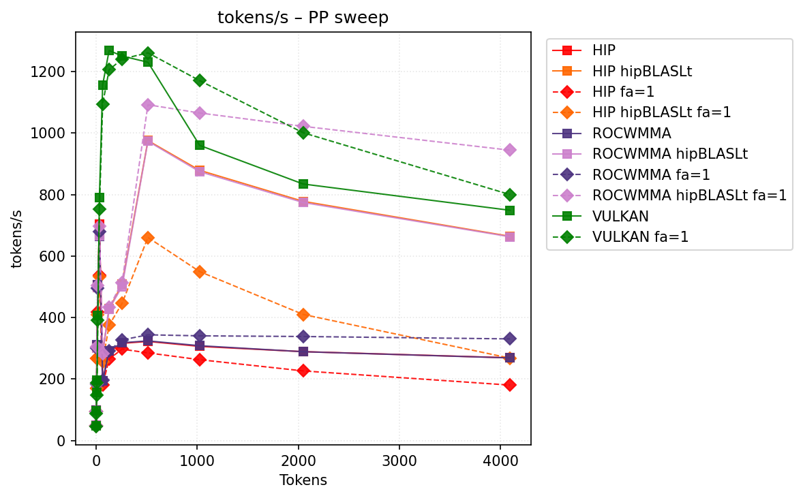
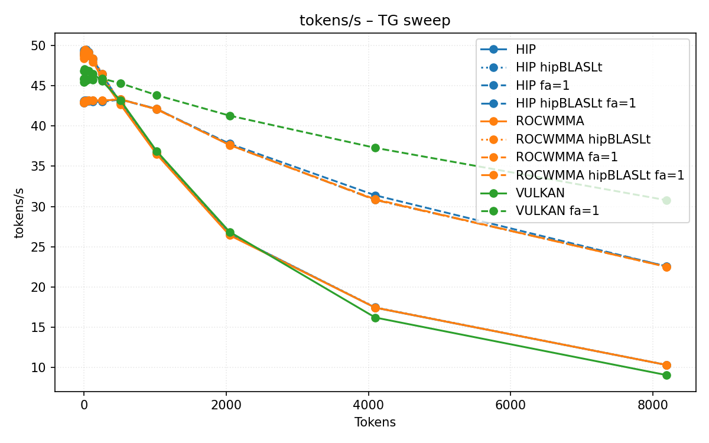
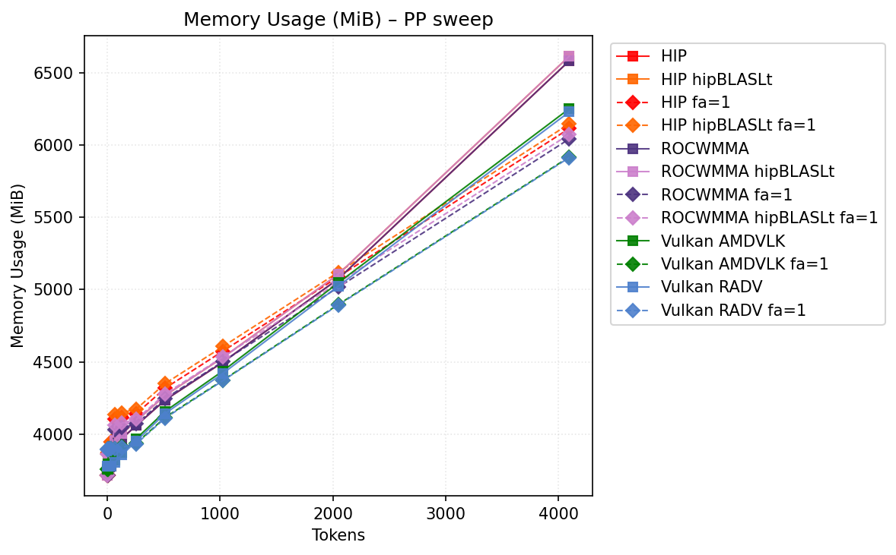

# Benchmark Results
| backend                 | hipblaslt   | -fa   | -b   | pp512           | tg128         | max_mem   |
|-------------------------|-------------|-------|------|-----------------|---------------|-----------|
| llama.cpp-hip           |             |       |      | 322.43959       | 49.184562     | 6582      |
| llama.cpp-hip           | 1           |       |      | 975.304354      | 49.433559     | 6614      |
| llama.cpp-hip           |             | -fa 1 |      | 285.15663       | 48.933134     | 6114      |
| llama.cpp-hip           | 1           | -fa 1 |      | 660.493001      | 48.969038     | 6146      |
| llama.cpp-rocwmma       |             |       |      | 324.126947      | 49.200214     | 6582      |
| llama.cpp-rocwmma       | 1           |       |      | 973.332649      | 49.177866     | 6614      |
| llama.cpp-rocwmma       |             | -fa 1 |      | 343.926045      | 48.04995      | 6042      |
| llama.cpp-rocwmma       | 1           | -fa 1 |      | 1091.814948     | 48.051536     | 6074      |
| llama.cpp-vulkan_amdvlk |             |       |      | 1018.118761     | 47.387504     | 6251      |
| llama.cpp-vulkan_amdvlk |             | -fa 1 |      | **1294.076129** | 46.727175     | 5917      |
| llama.cpp-vulkan_radv   |             |       |      | 783.651711      | **52.030723** | 6229      |
| llama.cpp-vulkan_radv   |             | -fa 1 |      | 924.856359      | 51.224352     | **5913**  |
## Performance Charts

### Tokens/s Performance

### Memory Usage

## Detailed Sweeps

### PP sweep
| backend                 | hipblaslt   | -fa   | -b   | 1             | 2             | 4              | 8              | 16             | 32             | 64              | 128             | 256             | 512             | 1024          | 2048            | 4096           |
|-------------------------|-------------|-------|------|---------------|---------------|----------------|----------------|----------------|----------------|-----------------|-----------------|-----------------|-----------------|---------------|-----------------|----------------|
| llama.cpp-hip           |             |       |      | 50.041847     | **98.781962** | **189.265735** | 310.314475     | **506.721648** | 704.484972     | 194.71549       | 288.844602      | 316.199361      | 322.43959       | 306.265802    | 289.166869      | 269.159029     |
| llama.cpp-hip           | 1           |       |      | 50.333522     | 98.551803     | 188.433052     | 303.833616     | 497.406198     | 671.246991     | 285.467529      | 428.236035      | 508.485388      | 975.304354      | 878.695201    | 777.769602      | 664.048317     |
| llama.cpp-hip           |             | -fa 1 |      | 49.008046     | 95.319251     | 169.455804     | 267.553147     | 417.242486     | 537.616703     | 179.938924      | 265.206538      | 297.298933      | 285.15663       | 263.032749    | 226.57558       | 180.365128     |
| llama.cpp-hip           | 1           | -fa 1 |      | 49.03083      | 95.197985     | 169.244765     | 267.723308     | 408.347037     | 534.140537     | 255.83982       | 375.156683      | 446.139289      | 660.493001      | 549.458192    | 410.149719      | 267.912552     |
| llama.cpp-rocwmma       |             |       |      | 49.97621      | 98.297988     | 188.398508     | **312.450303** | 506.417067     | 664.207671     | 194.305364      | 292.542688      | 318.268335      | 324.126947      | 308.519931    | 288.938077      | 268.796905     |
| llama.cpp-rocwmma       | 1           |       |      | 49.744981     | 97.936704     | 186.893265     | 301.380791     | 496.894911     | 665.333161     | 287.426132      | 427.779636      | 500.625903      | 973.332649      | 874.302776    | 774.086798      | 662.61912      |
| llama.cpp-rocwmma       |             | -fa 1 |      | 48.041695     | 94.744105     | 182.21774      | 300.233771     | 496.568835     | 679.055638     | 196.048317      | 292.035856      | 327.329776      | 343.926045      | 340.581322    | 338.389592      | 330.644852     |
| llama.cpp-rocwmma       | 1           | -fa 1 |      | 48.003905     | 94.846697     | 185.243245     | 304.399325     | 505.158293     | 696.80726      | 282.948027      | 433.651516      | 514.322302      | 1091.814948     | 1065.078646   | **1021.728936** | **944.065841** |
| llama.cpp-vulkan_amdvlk |             |       |      | 47.996054     | 92.791229     | 153.770205     | 186.343983     | 374.674326     | **724.600423** | **1120.207538** | **1326.971255** | **1286.864983** | 1018.118761     | 963.029653    | 829.919515      | 748.202025     |
| llama.cpp-vulkan_amdvlk |             | -fa 1 |      | 46.585181     | 84.435006     | 141.053386     | 178.436637     | 357.306383     | 685.521095     | 1038.69745      | 1227.791706     | 1282.042607     | **1294.076129** | **1189.3887** | 1019.226933     | 782.75456      |
| llama.cpp-vulkan_radv   |             |       |      | **52.591338** | 98.341572     | 175.698292     | 238.886698     | 303.988638     | 592.42902      | 708.682539      | 856.231082      | 871.411949      | 783.651711      | 701.428474    | 629.035227      | 574.064946     |
| llama.cpp-vulkan_radv   |             | -fa 1 |      | 50.789201     | 97.187768     | 173.897454     | 231.715939     | 301.334017     | 589.481396     | 699.9182        | 849.326459      | 886.077263      | 924.856359      | 891.121873    | 837.930678      | 750.800485     |
### TG sweep
| backend                 | hipblaslt   | -fa   | -b   | 1             | 2             | 4             | 8             | 16           | 32            | 64            | 128           | 256           | 512           | 1024          | 2048          | 4096          |
|-------------------------|-------------|-------|------|---------------|---------------|---------------|---------------|--------------|---------------|---------------|---------------|---------------|---------------|---------------|---------------|---------------|
| llama.cpp-hip           |             |       |      | 50.308884     | 50.214196     | 50.349151     | 50.092599     | 50.216014    | 50.300446     | 50.05624      | 49.184562     | 47.782307     | 44.122183     | 37.591254     | 27.231107     | 17.816366     |
| llama.cpp-hip           | 1           |       |      | 50.319098     | 50.236431     | 50.206997     | 50.349715     | 50.172574    | 50.180779     | 49.772565     | 49.433559     | 47.746128     | 44.114472     | 37.577483     | 27.221697     | 17.806819     |
| llama.cpp-hip           |             | -fa 1 |      | 49.009519     | 49.004691     | 48.827943     | 48.896307     | 48.841012    | 48.82553      | 48.936263     | 48.933134     | 48.942322     | 48.299923     | 46.666539     | 44.032786     | 39.447716     |
| llama.cpp-hip           | 1           | -fa 1 |      | 48.933709     | 49.009811     | 49.038419     | 48.913311     | 48.962986    | 48.936389     | 48.904751     | 48.969038     | 48.909448     | 48.265556     | 46.681367     | 44.032616     | 39.406518     |
| llama.cpp-rocwmma       |             |       |      | 50.125839     | 50.281349     | 50.113979     | 50.06585      | 50.104897    | 50.139177     | 49.863915     | 49.200214     | 47.251977     | 43.692697     | 37.063702     | 26.846246     | 17.646825     |
| llama.cpp-rocwmma       | 1           |       |      | 50.170589     | 50.171046     | 50.171499     | 50.142453     | 50.145649    | 50.061448     | 49.884868     | 49.177866     | 47.359355     | 43.565807     | 37.123797     | 26.835626     | 17.657805     |
| llama.cpp-rocwmma       |             | -fa 1 |      | 47.812747     | 48.108235     | 48.068005     | 47.967346     | 48.052435    | 48.036243     | 48.061093     | 48.04995      | 48.018535     | 46.741542     | 44.986925     | 40.47084      | 33.822857     |
| llama.cpp-rocwmma       | 1           | -fa 1 |      | 48.096027     | 48.041685     | 48.083349     | 48.096928     | 48.079123    | 48.060947     | 48.090492     | 48.051536     | 48.068768     | 46.827153     | 45.025075     | 40.420662     | 33.798263     |
| llama.cpp-vulkan_amdvlk |             |       |      | 47.850261     | 47.613048     | 47.712278     | 47.883909     | 47.991623    | 47.869068     | 47.651334     | 47.387504     | 46.206814     | 43.589377     | 37.284892     | 27.112548     | 17.794464     |
| llama.cpp-vulkan_amdvlk |             | -fa 1 |      | 46.552382     | 46.607501     | 46.515288     | 46.42714      | 46.66583     | 46.446089     | 46.457701     | 46.727175     | 46.70369      | 45.887418     | 44.663428     | 42.142019     | 37.739053     |
| llama.cpp-vulkan_radv   |             |       |      | **52.417427** | **52.428064** | **52.654246** | **53.022182** | **52.68825** | **52.637904** | **52.557406** | **52.030723** | 50.808542     | 47.512134     | 39.811881     | 28.766946     | 18.462298     |
| llama.cpp-vulkan_radv   |             | -fa 1 |      | 50.976645     | 51.098271     | 50.990973     | 51.044291     | 51.061281    | 51.069845     | 51.238121     | 51.224352     | **51.235052** | **50.127127** | **48.748596** | **45.312028** | **39.817895** |