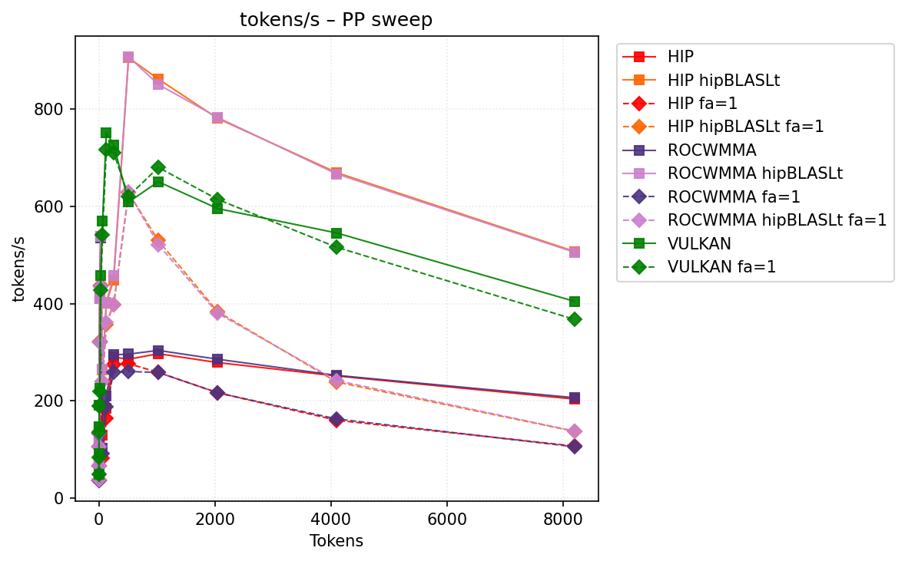
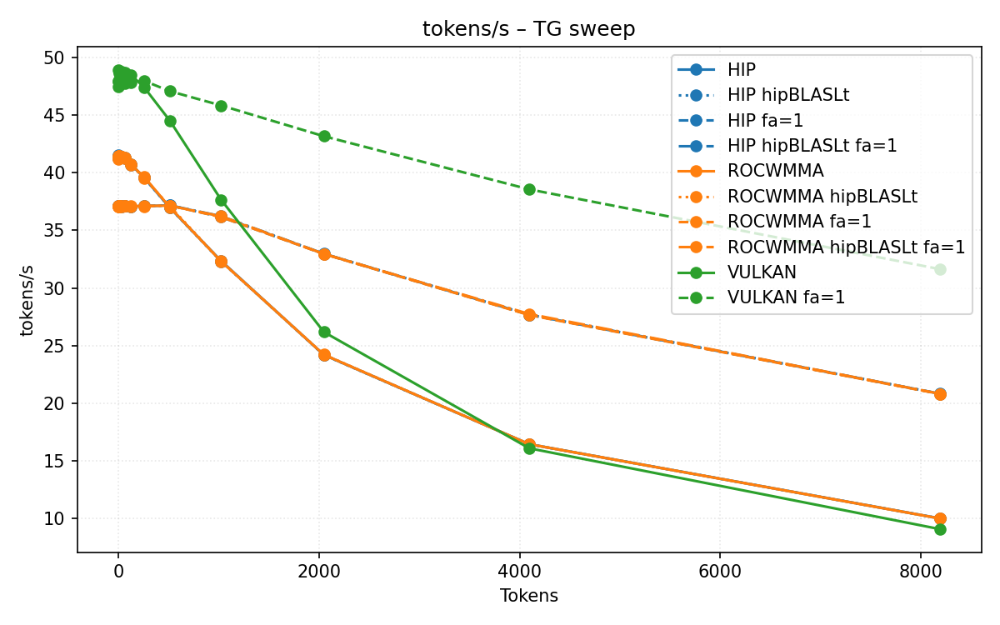
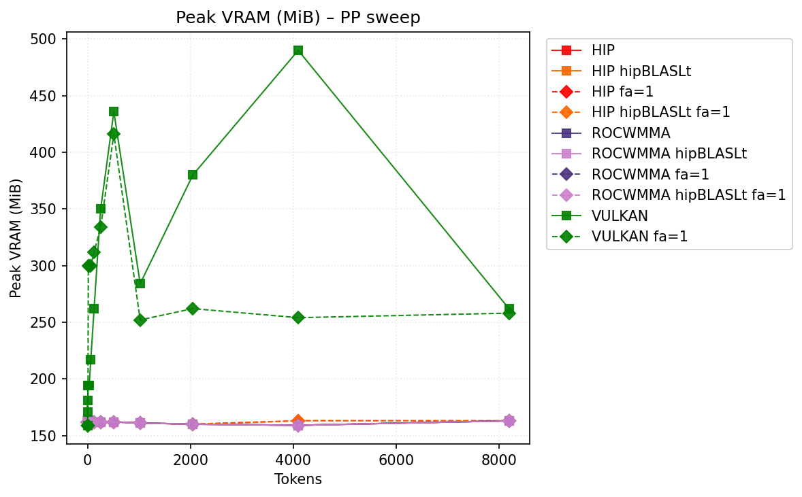
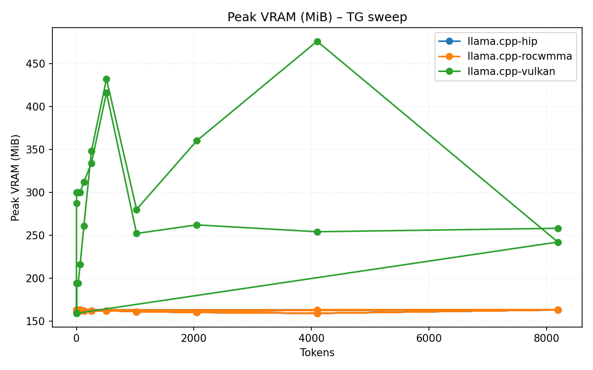

# Benchmark Results
| backend           | hipblaslt   | -fa   | -b   | pp512           | tg128         | max_mem   |
|-------------------|-------------|-------|------|-----------------|---------------|-----------|
| llama.cpp-hip     |             |       |      | 320.381391      | 42.41522      | 10824     |
| llama.cpp-hip     | 1           |       |      | 967.308757      | 42.535282     | 10856     |
| llama.cpp-hip     |             | -fa 1 |      | 283.60929       | 42.219016     | 8368      |
| llama.cpp-hip     | 1           | -fa 1 |      | 659.0148        | 42.150439     | 8400      |
| llama.cpp-rocwmma |             |       |      | 322.7789        | 42.329557     | 10824     |
| llama.cpp-rocwmma | 1           |       |      | 964.101541      | 42.279409     | 10856     |
| llama.cpp-rocwmma |             | -fa 1 |      | 340.563677      | 41.263739     | 8368      |
| llama.cpp-rocwmma | 1           | -fa 1 |      | **1083.005366** | 41.320302     | 8400      |
| llama.cpp-vulkan  |             |       |      | 766.534975      | **49.241306** | 8717      |
| llama.cpp-vulkan  |             | -fa 1 |      | 787.591059      | 48.747756     | **8151**  |
## Performance Charts

### Tokens/s Performance

### Memory Usage

## Detailed Sweeps

### PP sweep
| backend           | hipblaslt   | -fa   | -b   | 1             | 2             | 4              | 8              | 16            | 32             | 64             | 128            | 256            | 512             | 1024            | 2048            | 4096           | 8192           |
|-------------------|-------------|-------|------|---------------|---------------|----------------|----------------|---------------|----------------|----------------|----------------|----------------|-----------------|-----------------|-----------------|----------------|----------------|
| llama.cpp-hip     |             |       |      | 42.985954     | 77.063267     | 122.861818     | 148.565223     | 443.257473    | 562.133736     | 193.939957     | 287.632846     | 314.245111     | 320.381391      | 305.111268      | 287.010349      | 269.204685     | 203.669738     |
| llama.cpp-hip     | 1           |       |      | 43.062598     | 75.945023     | 120.167135     | 150.55304      | 432.734159    | 562.795146     | 283.864808     | 425.361297     | 505.744289     | 967.308757      | 872.482434      | 770.797618      | 660.431037     | **507.446404** |
| llama.cpp-hip     |             | -fa 1 |      | 42.131907     | 74.20946      | 113.458908     | 140.710406     | 372.89207     | 462.691254     | 178.954964     | 264.06755      | 295.65257      | 283.60929       | 261.300017      | 225.126167      | 174.864696     | 106.880911     |
| llama.cpp-hip     | 1           | -fa 1 |      | 42.206202     | 74.496816     | 114.944422     | 144.825821     | 369.2253      | 461.863792     | 254.14423      | 378.345372     | 435.999114     | 659.0148        | 543.651595      | 408.055911      | 261.013577     | 137.297921     |
| llama.cpp-rocwmma |             |       |      | 42.853355     | 75.541909     | 120.976617     | 149.279449     | 447.280311    | 566.830426     | 194.202433     | 287.690655     | 317.02322      | 322.7789        | 307.547881      | 287.740052      | 269.387408     | 206.455826     |
| llama.cpp-rocwmma | 1           |       |      | 42.929958     | 75.432735     | 120.242659     | 152.514598     | 436.929108    | 577.851651     | 281.407628     | 426.263215     | 506.495865     | 964.101541      | 871.706282      | 771.379447      | 658.504053     | 505.833665     |
| llama.cpp-rocwmma |             | -fa 1 |      | 41.306068     | 73.510162     | 116.875172     | 150.509756     | 445.064779    | **579.361194** | 194.796996     | 287.268778     | 325.03879      | 340.563677      | 338.846931      | 334.415262      | 326.003342     | 105.568083     |
| llama.cpp-rocwmma | 1           | -fa 1 |      | 41.118507     | 73.05319      | 116.889879     | 150.29443      | **448.53683** | 573.171986     | 281.418728     | 432.023927     | 524.025168     | **1083.005366** | **1057.171757** | **1014.084466** | **935.817487** | 137.728089     |
| llama.cpp-vulkan  |             |       |      | **50.443953** | **92.215479** | **156.598383** | **204.229277** | 238.819999    | 464.082092     | **623.698233** | **764.005949** | **761.678815** | 766.534975      | 657.972622      | 596.669796      | 551.605098     | 404.855574     |
| llama.cpp-vulkan  |             | -fa 1 |      | 48.796935     | 86.188637     | 145.024109     | 196.498141     | 232.90317     | 452.902026     | 605.293591     | 742.458893     | 759.227066     | 787.591059      | 743.068509      | 673.243852      | 575.253664     | 367.664749     |
### TG sweep
| backend           | hipblaslt   | -fa   | -b   | 1             | 2             | 4             | 8             | 16            | 32           | 64            | 128           | 256           | 512           | 1024          | 2048          | 4096          | 8192              |
|-------------------|-------------|-------|------|---------------|---------------|---------------|---------------|---------------|--------------|---------------|---------------|---------------|---------------|---------------|---------------|---------------|-------------------|
| llama.cpp-hip     |             |       |      | 42.955211     | 43.272816     | 43.163696     | 43.118758     | 43.171719     | 43.034779    | 42.987742     | 42.41522      | 41.354354     | 38.605249     | 33.490169     | 25.028067     | 16.858959     | 9.965761          |
| llama.cpp-hip     | 1           |       |      | 42.838557     | 43.060372     | 43.088878     | 43.111908     | 43.006798     | 43.071423    | 42.952668     | 42.535282     | 41.364186     | 38.673625     | 33.535777     | 25.028941     | 16.84857      | 9.961335          |
| llama.cpp-hip     |             | -fa 1 |      | 41.987059     | 42.276907     | 42.104613     | 42.075132     | 42.129619     | 42.189228    | 42.13704      | 42.219016     | 42.231155     | 41.689156     | 40.428765     | 38.443264     | 34.961792     | 20.804218         |
| llama.cpp-hip     | 1           | -fa 1 |      | 42.06116      | 42.056728     | 42.148951     | 41.971749     | 42.107748     | 42.095513    | 42.052752     | 42.150439     | 42.212141     | 41.591686     | 40.459304     | 38.437149     | 34.886277     | 20.80014          |
| llama.cpp-rocwmma |             |       |      | 43.07332      | 43.042063     | 43.183147     | 42.889231     | 42.919018     | 43.01813     | 42.825178     | 42.329557     | 40.953405     | 38.20177      | 33.107628     | 24.7174       | 16.711671     | 9.957840000000001 |
| llama.cpp-rocwmma | 1           |       |      | 42.928614     | 42.810319     | 43.053133     | 43.068438     | 42.985394     | 43.012192    | 42.776733     | 42.279409     | 41.039927     | 38.253969     | 33.096169     | 24.708785     | 16.709252     | 9.961648          |
| llama.cpp-rocwmma |             | -fa 1 |      | 41.332978     | 41.525275     | 41.33503      | 41.388411     | 41.316838     | 41.357941    | 41.304792     | 41.263739     | 41.332306     | 40.401311     | 39.094183     | 35.621928     | 30.332357     | 20.781466         |
| llama.cpp-rocwmma | 1           | -fa 1 |      | 41.318502     | 41.261636     | 41.313633     | 41.421231     | 41.315746     | 41.362741    | 41.307566     | 41.320302     | 41.286302     | 40.33093      | 39.110067     | 35.573954     | 30.314526     | 20.797194         |
| llama.cpp-vulkan  |             |       |      | **50.042932** | **50.018109** | **50.156461** | **49.953094** | **50.289066** | **50.35308** | **50.087345** | **49.241306** | 47.97184      | 45.678132     | 39.224795     | 28.138099     | 18.3097       | 9.034019          |
| llama.cpp-vulkan  |             | -fa 1 |      | 48.995925     | 48.855529     | 49.14312      | 49.010622     | 48.973657     | 49.241647    | 49.147634     | 48.747756     | **48.507246** | **47.637056** | **46.272148** | **43.727614** | **39.014871** | **31.629303**     |