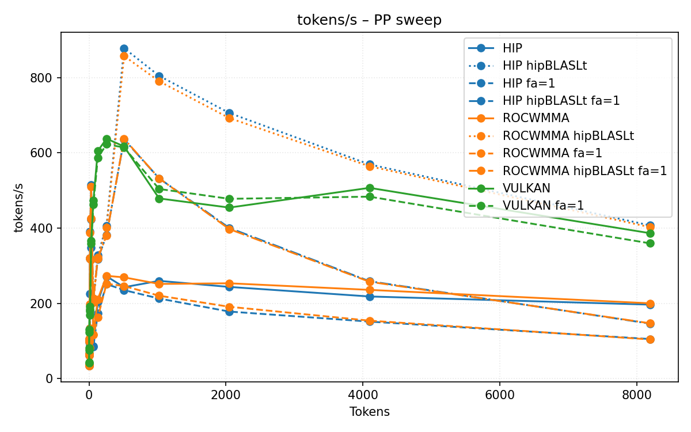
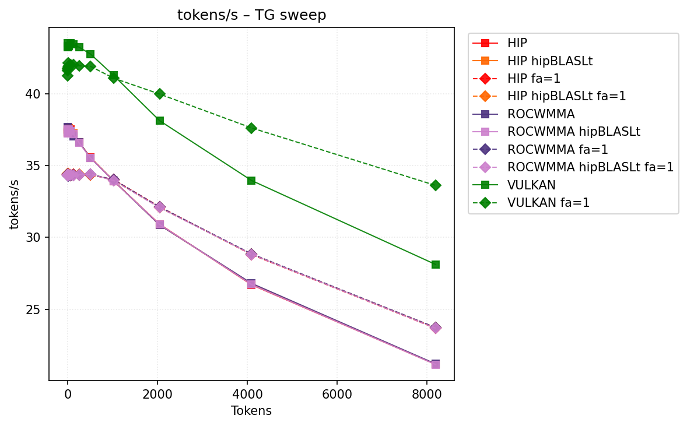
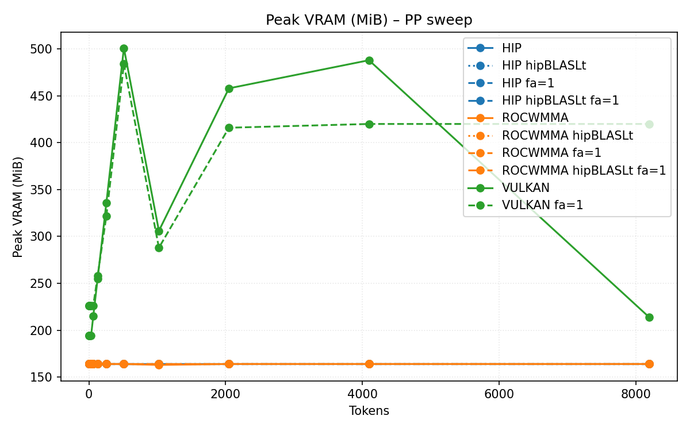
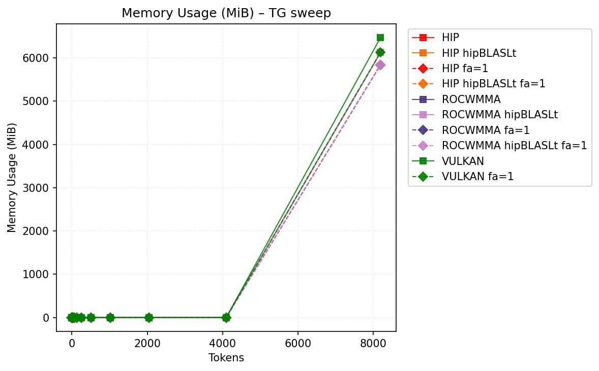

# Benchmark Results
| backend           | hipblaslt   | -fa   | -b   | pp512          | tg128         | max_mem   |
|-------------------|-------------|-------|------|----------------|---------------|-----------|
| llama.cpp-hip     |             |       |      | 243.050646     | 37.241002     | 8143      |
| llama.cpp-hip     | 1           |       |      | **878.180293** | 37.236084     | 8175      |
| llama.cpp-hip     |             | -fa 1 |      | 235.269413     | 34.3895       | **6067**  |
| llama.cpp-hip     | 1           | -fa 1 |      | 635.621425     | 34.361636     | 6099      |
| llama.cpp-rocwmma |             |       |      | 269.246867     | 37.033431     | 8143      |
| llama.cpp-rocwmma | 1           |       |      | 857.463493     | 37.205605     | 8175      |
| llama.cpp-rocwmma |             | -fa 1 |      | 246.134132     | 34.372826     | **6067**  |
| llama.cpp-rocwmma | 1           | -fa 1 |      | 637.410176     | 34.3105       | 6099      |
| llama.cpp-vulkan  |             |       |      | 616.986417     | **43.415714** | 6492      |
| llama.cpp-vulkan  |             | -fa 1 |      | 614.198399     | 42.007634     | 6135      |
## Performance Charts

### Tokens/s Performance

### Memory Usage

## Detailed Sweeps

### PP sweep
| backend           | hipblaslt   | -fa   | -b   | 1            | 2             | 4              | 8              | 16             | 32             | 64             | 128            | 256            | 512            | 1024          | 2048          | 4096           | 8192           |
|-------------------|-------------|-------|------|--------------|---------------|----------------|----------------|----------------|----------------|----------------|----------------|----------------|----------------|---------------|---------------|----------------|----------------|
| llama.cpp-hip     |             |       |      | 37.239489    | 66.072129     | 105.326675     | 134.021909     | **390.271594** | **515.029936** | 86.288238      | 203.733926     | 272.00669      | 243.050646     | 259.94703     | 243.817603    | 218.4407       | 196.777822     |
| llama.cpp-hip     | 1           |       |      | 37.34568     | 66.375638     | 105.284736     | 90.703737      | 225.768222     | 348.652961     | 207.736773     | 327.58896      | 406.919426     | **878.180293** | **804.52417** | **705.96675** | **569.231115** | **407.242257** |
| llama.cpp-hip     |             | -fa 1 |      | 34.388994    | 61.401169     | 97.322424      | 126.034234     | 319.709109     | 424.781877     | 84.347979      | 173.131997     | 251.415305     | 235.269413     | 212.986297    | 178.371339    | 151.677586     | 105.354111     |
| llama.cpp-hip     | 1           | -fa 1 |      | 34.381409    | 61.431827     | 98.02967       | 127.407083     | 320.442918     | 423.756411     | 213.556336     | 317.223881     | 381.378098     | 635.621425     | 532.224051    | 400.54195     | 258.969465     | 146.329906     |
| llama.cpp-rocwmma |             |       |      | 37.427067    | 66.085218     | 105.889773     | 133.181635     | 388.428944     | 510.529744     | 116.606407     | 211.070549     | 273.242371     | 269.246867     | 251.733561    | 253.469552    | 235.946014     | 200.319857     |
| llama.cpp-rocwmma | 1           |       |      | 37.072805    | 66.038476     | 104.60295      | 81.965053      | 198.009416     | 316.478953     | 203.381199     | 321.729521     | 401.961819     | 857.463493     | 790.128401    | 692.520237    | 564.362519     | 402.586271     |
| llama.cpp-rocwmma |             | -fa 1 |      | 34.351364    | 61.302456     | 98.759229      | 127.970104     | 319.809143     | 424.175549     | 116.635024     | 162.320846     | 252.217152     | 246.134132     | 220.476107    | 191.08322     | 154.214564     | 104.26495      |
| llama.cpp-rocwmma | 1           | -fa 1 |      | 34.333374    | 61.388686     | 99.02367       | 126.772013     | 318.724044     | 425.417238     | 213.127224     | 319.691975     | 380.331792     | 637.410176     | 532.285334    | 397.54791     | 257.554222     | 147.196762     |
| llama.cpp-vulkan  |             |       |      | **42.88789** | **81.557391** | **131.207199** | **179.192791** | 191.600848     | 365.87557      | **472.791895** | **604.858138** | **637.684356** | 616.986417     | 478.886775    | 454.589138    | 507.017918     | 386.581865     |
| llama.cpp-vulkan  |             | -fa 1 |      | 42.050588    | 75.037325     | 123.527004     | 169.256469     | 185.040875     | 358.064349     | 462.35594      | 586.59749      | 622.886306     | 614.198399     | 504.046659    | 477.868452    | 483.631085     | 359.61209      |
### TG sweep
| backend           | hipblaslt   | -fa   | -b   | 1             | 2             | 4             | 8             | 16            | 32            | 64            | 128           | 256           | 512                | 1024          | 2048          | 4096          | 8192          |
|-------------------|-------------|-------|------|---------------|---------------|---------------|---------------|---------------|---------------|---------------|---------------|---------------|--------------------|---------------|---------------|---------------|---------------|
| llama.cpp-hip     |             |       |      | 37.261876     | 37.344145     | 37.514338     | 37.566491     | 37.635503     | 37.538275     | 37.51205      | 37.241002     | 36.60754      | 35.557079          | 33.921251     | 30.919289     | 26.707391     | 21.174271     |
| llama.cpp-hip     | 1           |       |      | 37.299267     | 37.461255     | 37.538311     | 37.603698     | 37.550752     | 37.613016     | 37.433366     | 37.236084     | 36.621245     | 35.536243999999996 | 33.957828     | 30.870126     | 26.777917     | 21.183963     |
| llama.cpp-hip     |             | -fa 1 |      | 34.337823     | 34.395603     | 34.409202     | 34.424044     | 34.382696     | 34.36227      | 34.316944     | 34.3895       | 34.346709     | 34.359324          | 34.020211     | 32.128261     | 28.808533     | 23.68605      |
| llama.cpp-hip     | 1           | -fa 1 |      | 34.449459     | 34.402459     | 34.401012     | 34.335763     | 34.398339     | 34.377955     | 34.372179     | 34.361636     | 34.387315     | 34.371084          | 33.992818     | 32.092416     | 28.83866      | 23.724341     |
| llama.cpp-rocwmma |             |       |      | 37.370632     | 37.471429     | 37.676647     | 37.469533     | 37.477115     | 37.503699     | 37.40955      | 37.033431     | 36.634135     | 35.521081          | 33.939731     | 30.862993     | 26.806019     | 21.206953     |
| llama.cpp-rocwmma | 1           |       |      | 37.229633     | 37.35451      | 37.524624     | 37.454804     | 37.454881     | 37.53108      | 37.383723     | 37.205605     | 36.572392     | 35.516111          | 33.926689     | 30.905404     | 26.723718     | 21.164052     |
| llama.cpp-rocwmma |             | -fa 1 |      | 34.309668     | 34.38353      | 34.361074     | 34.286991     | 34.307966     | 34.335064     | 34.329958     | 34.372826     | 34.349659     | 34.38613           | 34.016008     | 32.119581     | 28.856065     | 23.735844     |
| llama.cpp-rocwmma | 1           | -fa 1 |      | 34.348953     | 34.323087     | 34.354724     | 34.332736     | 34.363521     | 34.344448     | 34.36114      | 34.3105       | 34.370017     | 34.393133          | 33.958346     | 32.06682      | 28.822427     | 23.688242     |
| llama.cpp-vulkan  |             |       |      | **43.212433** | **43.500323** | **43.321209** | **43.250991** | **43.266726** | **43.323374** | **43.508514** | **43.415714** | **43.227962** | **42.749342**      | **41.268183** | 38.12014      | 33.957951     | 28.120159     |
| llama.cpp-vulkan  |             | -fa 1 |      | 41.602524     | 41.229823     | 41.735043     | 42.116555     | 41.846828     | 41.924714     | 42.022124     | 42.007634     | 41.933669     | 41.894406          | 41.07654      | **39.970133** | **37.614547** | **33.615882** |