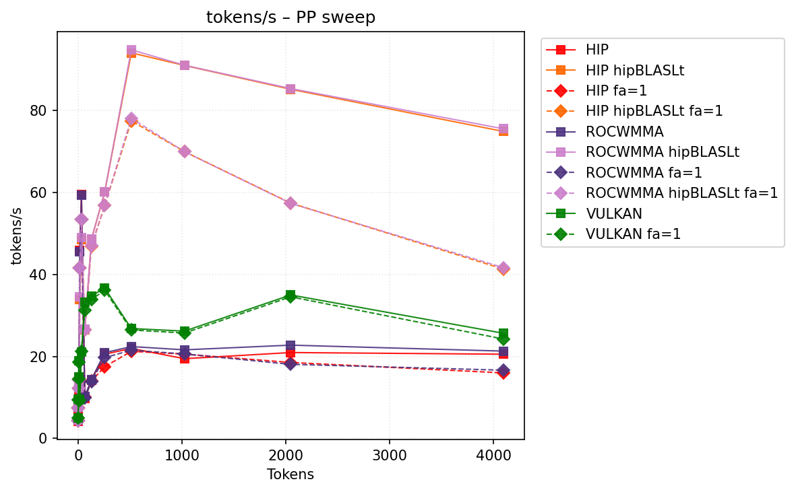
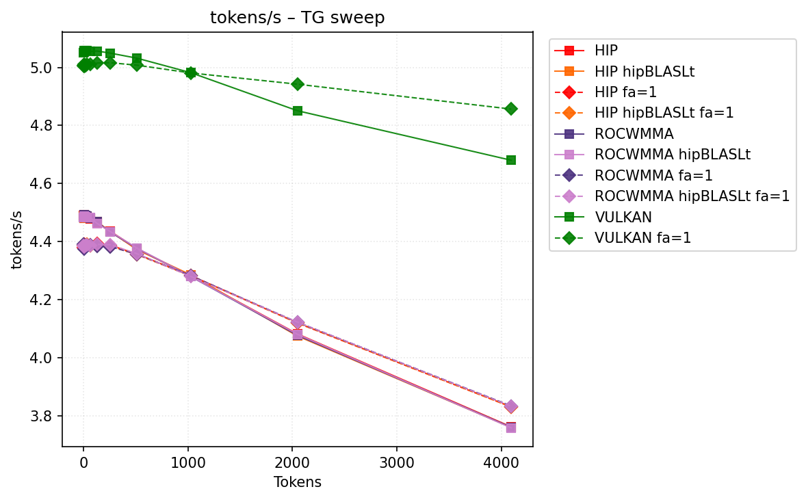
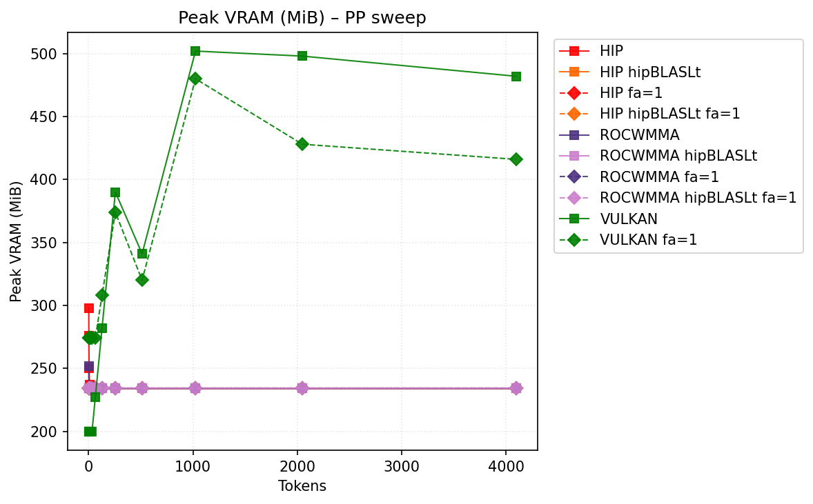
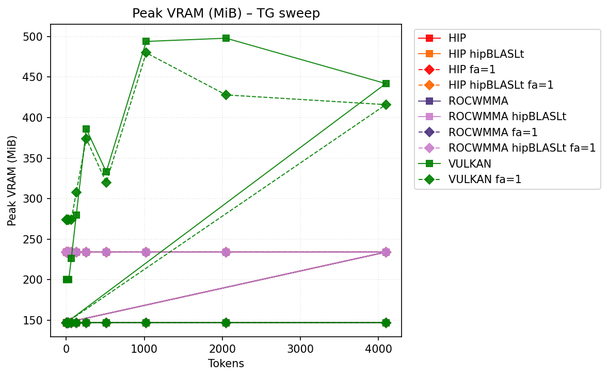

# Benchmark Results
| backend           | hipblaslt   | -fa   | -b   |   pp512 |   tg128 | max_mem   |
|-------------------|-------------|-------|------|---------|---------|-----------|
| llama.cpp-hip     |             |       |      |     nan |     nan | 42719     |
| llama.cpp-hip     | 1           |       |      |     nan |     nan | 42751     |
| llama.cpp-hip     |             | -fa 1 |      |     nan |     nan | 42441     |
| llama.cpp-hip     | 1           | -fa 1 |      |     nan |     nan | 42473     |
| llama.cpp-rocwmma |             |       |      |     nan |     nan | 42719     |
| llama.cpp-rocwmma | 1           |       |      |     nan |     nan | 42751     |
| llama.cpp-rocwmma |             | -fa 1 |      |     nan |     nan | 42441     |
| llama.cpp-rocwmma | 1           | -fa 1 |      |     nan |     nan | 42473     |
| llama.cpp-vulkan  |             |       |      |     nan |     nan | 42754     |
| llama.cpp-vulkan  |             | -fa 1 |      |     nan |     nan | **42410** |
## Performance Charts

### Tokens/s Performance

### Memory Usage

## Detailed Sweeps

### PP sweep
| backend           | hipblaslt   | -fa   | -b   |   1 |   2 |   4 |   8 |   16 |   32 |   64 |   128 |   256 |   512 |   1024 |   2048 |   4096 |
|-------------------|-------------|-------|------|-----|-----|-----|-----|------|------|------|-------|-------|-------|--------|--------|--------|
| llama.cpp-hip     |             |       |      | nan | nan | nan | nan |  nan |  nan |  nan |   nan |   nan |   nan |    nan |    nan |    nan |
| llama.cpp-hip     | 1           |       |      | nan | nan | nan | nan |  nan |  nan |  nan |   nan |   nan |   nan |    nan |    nan |    nan |
| llama.cpp-hip     |             | -fa 1 |      | nan | nan | nan | nan |  nan |  nan |  nan |   nan |   nan |   nan |    nan |    nan |    nan |
| llama.cpp-hip     | 1           | -fa 1 |      | nan | nan | nan | nan |  nan |  nan |  nan |   nan |   nan |   nan |    nan |    nan |    nan |
| llama.cpp-rocwmma |             |       |      | nan | nan | nan | nan |  nan |  nan |  nan |   nan |   nan |   nan |    nan |    nan |    nan |
| llama.cpp-rocwmma | 1           |       |      | nan | nan | nan | nan |  nan |  nan |  nan |   nan |   nan |   nan |    nan |    nan |    nan |
| llama.cpp-rocwmma |             | -fa 1 |      | nan | nan | nan | nan |  nan |  nan |  nan |   nan |   nan |   nan |    nan |    nan |    nan |
| llama.cpp-rocwmma | 1           | -fa 1 |      | nan | nan | nan | nan |  nan |  nan |  nan |   nan |   nan |   nan |    nan |    nan |    nan |
| llama.cpp-vulkan  |             |       |      | nan | nan | nan | nan |  nan |  nan |  nan |   nan |   nan |   nan |    nan |    nan |    nan |
| llama.cpp-vulkan  |             | -fa 1 |      | nan | nan | nan | nan |  nan |  nan |  nan |   nan |   nan |   nan |    nan |    nan |    nan |
### TG sweep
| backend           | hipblaslt   | -fa   | -b   |   1 |   2 |   4 |   8 |   16 |   32 |   64 |   128 |   256 |   512 |   1024 |   2048 |   4096 |
|-------------------|-------------|-------|------|-----|-----|-----|-----|------|------|------|-------|-------|-------|--------|--------|--------|
| llama.cpp-hip     |             |       |      | nan | nan | nan | nan |  nan |  nan |  nan |   nan |   nan |   nan |    nan |    nan |    nan |
| llama.cpp-hip     | 1           |       |      | nan | nan | nan | nan |  nan |  nan |  nan |   nan |   nan |   nan |    nan |    nan |    nan |
| llama.cpp-hip     |             | -fa 1 |      | nan | nan | nan | nan |  nan |  nan |  nan |   nan |   nan |   nan |    nan |    nan |    nan |
| llama.cpp-hip     | 1           | -fa 1 |      | nan | nan | nan | nan |  nan |  nan |  nan |   nan |   nan |   nan |    nan |    nan |    nan |
| llama.cpp-rocwmma |             |       |      | nan | nan | nan | nan |  nan |  nan |  nan |   nan |   nan |   nan |    nan |    nan |    nan |
| llama.cpp-rocwmma | 1           |       |      | nan | nan | nan | nan |  nan |  nan |  nan |   nan |   nan |   nan |    nan |    nan |    nan |
| llama.cpp-rocwmma |             | -fa 1 |      | nan | nan | nan | nan |  nan |  nan |  nan |   nan |   nan |   nan |    nan |    nan |    nan |
| llama.cpp-rocwmma | 1           | -fa 1 |      | nan | nan | nan | nan |  nan |  nan |  nan |   nan |   nan |   nan |    nan |    nan |    nan |
| llama.cpp-vulkan  |             |       |      | nan | nan | nan | nan |  nan |  nan |  nan |   nan |   nan |   nan |    nan |    nan |    nan |
| llama.cpp-vulkan  |             | -fa 1 |      | nan | nan | nan | nan |  nan |  nan |  nan |   nan |   nan |   nan |    nan |    nan |    nan |